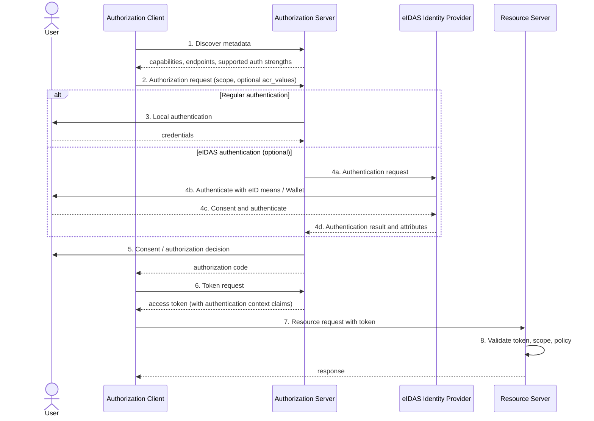

# Design: eIDAS Authentication as an Optional Step in the Authorization Transaction

Status: draft design note for ballot reconciliation on the authorization topic. Not yet IG page content.

Related notes: [eIDAS-AccessService-only-rationale.md](eIDAS-AccessService-only-rationale.md), [aspects-of-auth.md](aspects-of-auth.md), [decisions.md](decisions.md).

## Purpose

This note describes how eIDAS-recognised electronic identification is invoked as a **step inside the existing OAuth 2.0 authorization transaction**, rather than as a separate transaction or a separate protocol stack.

The design intent is:

- The normal authorization transaction is unchanged.
- eIDAS authentication is an **optional, conditional branch** of the user-authentication step performed by the Authorization Server.
- Whether the branch is taken is determined by the deployment and by the service being accessed, not by the resource API.

## Why this is modelled as an optional step

Two observations drive the design.

**From the regulation.** EHDS constrains eIDAS to the two end-user access services only. [Article 12](https://www.ringholm.com/ehds/article-12.htm) makes eIDAS-recognised means (or Article 36-compliant means) a condition of access to health professional access services. [Article 16(1)](https://www.ringholm.com/ehds/article-16.htm) gives natural persons the right to use such means on the [Article 4](https://www.ringholm.com/ehds/article-4.htm) access services. Nothing in the Regulation requires eIDAS for system-to-system exchange, secondary use, or HealthData@EU. See the [rationale note](eIDAS-AccessService-only-rationale.md).

**From the protocols.** Neither SMART App Launch nor IHE IUA specifies how the Authorization Server authenticates the end user. IUA states that the user-authentication method is to be defined in implementation projects or national extensions. User authentication is therefore already an unconstrained, pluggable step in both stacks. Introducing eIDAS does not require a new transaction; it requires naming one option for a step that is deliberately left open.

Consequently eIDAS is placed **inside** the authorization transaction, at the point where the Authorization Server authenticates the user, and is marked optional.

## Applicability

| Flow | eIDAS step applicable | Basis |
|---|---|---|
| Health professional access service | Yes — condition of access | Article 12 |
| Patient access service (Article 4) | Yes — must be accepted when the person chooses it | Article 16(1) |
| Cross-border access via MyHealth@EU | Yes, via the mechanism under Article 16(2)–(4) | Article 16 |
| System-to-system (EHR to EHR, NCP to NCP) | No — no end user is authenticated | No EHDS provision |
| Wellness application, backend/system authorization | No | No EHDS provision |
| Secondary use, HealthData@EU | No | No eIDAS reference in the enacted text |

Where the column reads "No", the client authenticates as a system and no user-authentication step exists to branch on.

## Actors

| Actor | Role in this transaction |
|---|---|
| End user | Natural person or health professional being authenticated |
| Authorization Client | The application requesting authorization (IUA Authorization Client / SMART app) |
| Authorization Server | Issues tokens; owns the user-authentication step and decides whether to invoke eIDAS |
| eIDAS Identity Provider | National eIDAS node, notified eID scheme, or EU Digital Identity Wallet acting as an eID means recognised under Article 6 of [Regulation (EU) No 910/2014](https://eur-lex.europa.eu/legal-content/EN/TXT/HTML/?uri=CELEX:32014R0910) |
| Resource Server | Validates the access token and enforces access policy |

The Authorization Client never speaks to the eIDAS Identity Provider directly. The eIDAS exchange is entirely between the Authorization Server and the identity provider, which keeps the client independent of the national identity mechanism.

## Transaction flow

Steps 1, 2, 5, 6, 7 and 8 are the ordinary authorization code flow. Steps 3 and 4 are the branch.

1. **Discovery.** The Authorization Client retrieves Authorization Server metadata. For IUA this is Get Authorization Server Metadata [ITI-103] at `https://{host}/.well-known/oauth-authorization-server`; for SMART App Launch it is the `.well-known/smart-configuration` endpoint on the FHIR server.
2. **Authorization request.** The client redirects the user agent to the `authorization_endpoint` with the requested scopes and, optionally, an authentication-strength request (see below).
3. **User authentication — regular path.** The Authorization Server authenticates the user by its normal local mechanism (username/password, federated login, institutional SSO, smartcard).
4. **User authentication — eIDAS path (optional).** Instead of, or in addition to, step 3, the Authorization Server delegates authentication to an eIDAS Identity Provider, receives the authentication result and identity attributes, and maps them to a local subject.
5. **Authorization decision.** The Authorization Server applies consent and policy, and determines the granted scope.
6. **Token issuance.** The client exchanges the authorization code for an access token. For IUA this is Get Access Token [ITI-71].
7. **Resource request.** The client presents the access token to the Resource Server. For IUA this is Incorporate Access Token [ITI-72].
8. **Enforcement.** The Resource Server validates the token, checks that the scope covers the request, and enforces local access policy.

## Requesting and reporting the eIDAS step

Three things must be expressible. None of them are defined by IUA, so this guide must specify them.

### Advertising support

The Authorization Server declares which authentication strengths it supports in its metadata. The OpenID Connect Discovery field `acr_values_supported` is the natural carrier, since RFC 8414 metadata is extensible and IUA ITI-103 explicitly does not define the value space.

A client that finds no eIDAS-capable value can decide before starting the flow whether the server is usable for an Article 12 service.

### Requesting the step

The client signals that eIDAS authentication is needed using the OpenID Connect `acr_values` request parameter on the authorization request. This is a request, not a command: the Authorization Server remains the authority on how the user is authenticated.

Two variants must be distinguished:

- **Required.** The client cannot accept a token issued after non-eIDAS authentication. Used for Article 12 health professional access services where the deployment has no Article 36 alternative.
- **Preferred.** The client would like eIDAS but can proceed otherwise. Used for Article 16(1) patient access, where the person holds a right to use eIDAS but is not obliged to.

### Reporting the result

The token, or the introspection response, must convey how the user was authenticated so the Resource Server can enforce policy. The OpenID Connect `acr` (authentication context class reference) and `amr` (authentication methods references) claims are the appropriate carriers.

This is an IG-level addition. IUA's JWT claim set requires `scope`, `iss`, `sub`, `client_id`, `aud`, `jti`, `exp` and `iat`, and defines no authentication-strength claim. Where the token is opaque, the same information is returned through Introspect Token [ITI-102].

## Error handling

| Condition | Behaviour |
|---|---|
| Client requires eIDAS, server cannot provide it | Authorization error at the `authorization_endpoint`. The OpenID Connect error code `unmet_authentication_requirements` is the closest defined value. |
| User abandons or fails eIDAS authentication | Normal `access_denied` authorization error |
| Token presents insufficient authentication context for the requested resource | Resource Server rejects the request. IUA directs a `401` for failed token verification, scope matching or policy enforcement. |
| Client requested eIDAS as preferred and server used another method | No error; the actual method is reported in `acr`/`amr` and the Resource Server decides |

## Design consequences

1. **The resource API is unaffected.** No FHIR interaction, search parameter or profile changes because eIDAS is in use. Authentication strength is carried in the token, not in the resource request.
2. **Clients remain portable across Member States.** The client requests an assurance level; the Authorization Server maps that onto the applicable national eID scheme or Wallet. The client does not implement eIDAS.
3. **The Article 36 alternative is preserved.** Because the step is expressed as an authentication-strength requirement rather than a hardcoded eIDAS binding, a deployment using Article 36-compliant means satisfies the same design.
4. **System-to-system flows are untouched.** With SMART Backend Services or the client credentials grant there is no user-authentication step, so the branch does not exist.

## Open issues

- **Assurance-level vocabulary.** Which `acr` values are used, and how they map to the eIDAS assurance levels (low, substantial, high). Candidate: reuse the eIDAS level-of-assurance URIs rather than minting local values.
- **Claim set for identity attributes.** Whether, and which, eIDAS minimum dataset attributes are carried into the token or made available to the Resource Server; and how these relate to IUA's `subject_name`, `subject_organization` and `person_id` extension claims.
- **Health professional attributes.** eIDAS authenticates a natural person. Article 12 requires that the person be a health professional. Where the professional role and its verification come from is a separate concern from authentication, and is not resolved by this design.
- **Cross-border.** How this design relates to the interoperable cross-border identification and authentication mechanism to be defined by the Commission under Article 16(2), which has no deadline in the enacted text.
- **Required vs preferred signalling.** Whether to define this through distinct `acr` values, a separate request parameter, or profile-level statements per access service.
- **Wallet.** The EU Digital Identity Wallet is not required by any EHDS article. This design treats it as one eID means among others, reached through the same step.

## Decision proposed

> eIDAS-recognised electronic identification is specified as an optional authentication step within the authorization transaction, invoked by the Authorization Server and reported to the Resource Server through authentication-context claims in the access token. It is applicable to the patient access service and the health professional access service only. It is not applicable to system-to-system authorization. Clients express the need for it as an authentication-strength requirement, so that Article 36-compliant alternatives satisfy the same specification.
