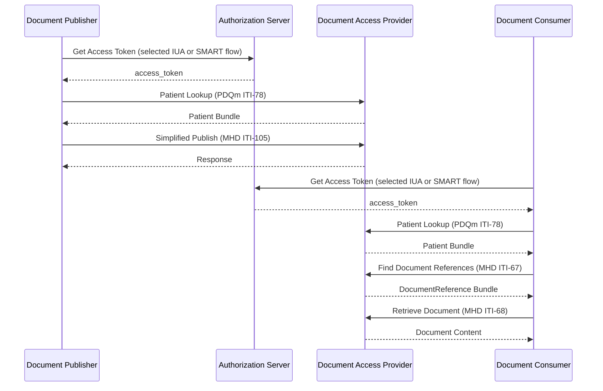
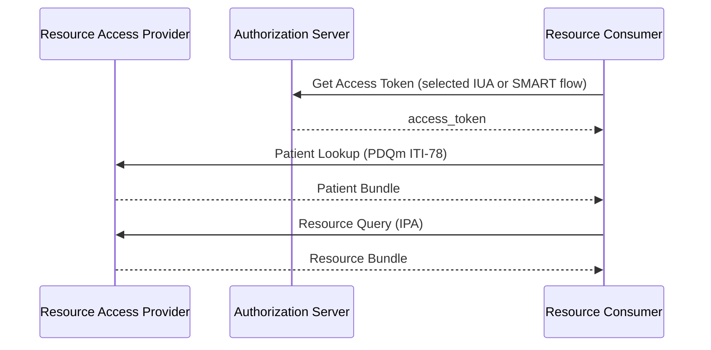

The actor model defined here is an orchestration of existing IHE actors and specifications, combined together into high-level composite actors. Actors and transactions are inherited from dependent IHE profiles, and those actors are stacked, constrained and potentially modified.

This is similar to the approach taken in the MHDS specification, but with a more narrow subset of specifications fit to the European situation.

### Relevant Specifications:

- Authorization
  - [HL7 SMART App Launch 2.2](https://hl7.org/fhir/smart-app-launch/STU2.2/) - Defines Standalone, Launch and Backend Services authorization for FHIR. Whether SMART App Launch is required depends on the environment and use case.
  - [IHE IUA](https://profiles.ihe.net/ITI/IUA/index.html) - Defines authorization and access control actors and mechanisms. Wether IUA is required depends on the environment and use case.
- Patient Identity Matching
  - [IHE PDQm](https://profiles.ihe.net/ITI/PDQm/index.html) - Defines how a client can perform patient lookup given demographics against a server.
- Document Exchange
  - [IHE MHD](https://profiles.ihe.net/ITI/MHD/) - Defines exchange of Documents, which we use to exchange FHIR document content.
- Resource Exchange
  - [HL7 International Patient Access (IPA)](https://hl7.org/fhir/uv/ipa/) - Defines how an application can access FHIR information using SMART authorization and resource access. IPA is the primary reference for resource access patterns.
- Foundational
  - [IHE Consistent Time](https://profiles.ihe.net/ITI/TF/Volume1/ch-7.html) - Defines the use of Network Time Protocol (NTP) to provide consistent time across systems.
  - [IHE ATNA](https://profiles.ihe.net/ITI/TF/Volume1/ch-9.html) - Referenced for secure transport requirements (TLS 1.2 Floor using BCP195 Option).

### Document Exchange

Document exchange is defined with 3 actors:



1. **Document Publisher (client)** - Produces EEHRxF FHIR Documents, publishes those documents to a Document Access Provider. Can be grouped with Access Provider, in which case the publishing transactions are internalized.
2. **Document Access Provider (server)** - Provides access to EEHRxF FHIR Documents by offering query APIs to Document Consumers. See **Document Submission Option** below for systems that accept document publication from external producers.
3. **Document Consumer (client)** - Consumes EEHRxF FHIR documents by querying a Document Access Provider.

These composite actors inherit existing actors from the selected IUA or SMART authorization
profile and from the PDQm and MHD specifications:



**Document Publisher**

- The selected [IUA Authorization Client](ActorDefinition-iua-authorization-client-eu-api.html), [SMART App](ActorDefinition-smart-app-eu-api.html), or [SMART Backend Service](ActorDefinition-smart-backend-service-eu-api.html); see [Authorization](authorization.html#environment-specific-requirements).
- [PDQm Patient Demographics Consumer](https://profiles.ihe.net/ITI/PDQm/volume-1.html) ([CapabilityStatement](https://profiles.ihe.net/ITI/PDQm/CapabilityStatement-IHE.PDQm.PatientDemographicsConsumerQuery.html))
- [MHD Document Source](https://profiles.ihe.net/ITI/MHD/1331_actors_and_transactions.html) with [Simplified Publish Option](https://profiles.ihe.net/ITI/MHD/1332_actor_options.html#13324-simplified-publish-option) ([CapabilityStatement](https://profiles.ihe.net/ITI/MHD/CapabilityStatement-IHE.MHD.DocumentSource.html))

**Document Access Provider**

- The selected [IUA Resource Server](ActorDefinition-iua-resource-server-eu-api.html) or [SMART FHIR Resource Server](ActorDefinition-smart-fhir-resource-server-eu-api.html); see [Authorization](authorization.html#environment-specific-requirements).
- An IUA or SMART Authorization Server is an independent actor. It MAY be co-located with the provider, but is not a required provider grouping.
- [PDQm Patient Demographics Supplier](https://profiles.ihe.net/ITI/PDQm/volume-1.html) ([CapabilityStatement](https://profiles.ihe.net/ITI/PDQm/CapabilityStatement-IHE.PDQm.PatientDemographicsSupplier.html))
- [MHD Document Responder](https://profiles.ihe.net/ITI/MHD/1331_actors_and_transactions.html) ([CapabilityStatement](https://profiles.ihe.net/ITI/MHD/CapabilityStatement-IHE.MHD.DocumentResponder.html))

**Document Submission Option** (when accepting external publication):
- [MHD Document Recipient](https://profiles.ihe.net/ITI/MHD/1331_actors_and_transactions.html) with [Simplified Publish Option](https://profiles.ihe.net/ITI/MHD/1332_actor_options.html#13324-simplified-publish-option) ([CapabilityStatement](https://profiles.ihe.net/ITI/MHD/CapabilityStatement-IHE.MHD.DocumentRecipient.html))

**Document Consumer**

- The selected [IUA Authorization Client](ActorDefinition-iua-authorization-client-eu-api.html), [SMART App](ActorDefinition-smart-app-eu-api.html), or [SMART Backend Service](ActorDefinition-smart-backend-service-eu-api.html); see [Authorization](authorization.html#environment-specific-requirements).
- [PDQm Patient Demographics Consumer](https://profiles.ihe.net/ITI/PDQm/volume-1.html) ([CapabilityStatement](https://profiles.ihe.net/ITI/PDQm/CapabilityStatement-IHE.PDQm.PatientDemographicsConsumerQuery.html))
- [MHD Document Consumer](https://profiles.ihe.net/ITI/MHD/1331_actors_and_transactions.html) ([CapabilityStatement](https://profiles.ihe.net/ITI/MHD/CapabilityStatement-IHE.MHD.DocumentConsumer.html))

This leads to the following required transactions between these actors:

See the following functional pages for detailed transaction information:
- [Authorization](authorization.html) - Authentication and authorization flows
- [Patient Lookup](patient-match.html) - Patient identification transactions
- [Document Exchange](document-exchange.html) - Document query and retrieval transactions

This can be combined with content profiles defined by each EHDS Priority Category, for those categories that are primarily represented as a FHIR Document. For example, a system can be a **Lab Result Document Publisher**, a **Patient Summary Document Consumer**, or a **Imaging Manifest Document Access Provider**. 

### Resource Exchange

It is also useful in many cases to transact with individual FHIR resources. For this purpose, two resource-based actors are defined:



4. **Resource Access Provider (server)** - A FHIR server providing access to FHIR resources by hosting search + read query API's.

5. **Resource Consumer (client)** - A FHIR client that consumes external FHIR resources by querying a Resource Access Provider.

<i>Note: What about Resource Producer? Click for more</i>

Resource exchange is more complex than document publication, and in many cases has resource and use-case specific considerations. Within the scope of this version of the IG, we assume a precondition that the Resource Access Provider has access to resources and focus on defining how the Resource Access Provider enables a consumer to search and read those resources. For more details and possible approaches, see the <a href="resourceExchange.html">Resource Exchange</a> page.

These composite actors inherit existing actors from the selected IUA or SMART authorization
profile, PDQm, and [International Patient Access (IPA)](https://hl7.org/fhir/uv/ipa/)
specifications (with QEDm alignment where compatible):



**Resource Access Provider**

- The selected [IUA Resource Server](ActorDefinition-iua-resource-server-eu-api.html) or [SMART FHIR Resource Server](ActorDefinition-smart-fhir-resource-server-eu-api.html); see [Authorization](authorization.html#environment-specific-requirements).
- An IUA or SMART Authorization Server is an independent actor. It MAY be co-located with the provider, but is not a required provider grouping.
- [PDQm Patient Demographics Supplier](https://profiles.ihe.net/ITI/PDQm/volume-1.html) ([CapabilityStatement](https://profiles.ihe.net/ITI/PDQm/CapabilityStatement-IHE.PDQm.PatientDemographicsSupplier.html))
- Resource Access
  - [HL7 International Patient Access Server](https://hl7.org/fhir/uv/ipa/) ([CapabilityStatement](https://hl7.org/fhir/uv/ipa/CapabilityStatement-ipa-server.html))

**Resource Consumer**

- The selected [IUA Authorization Client](ActorDefinition-iua-authorization-client-eu-api.html), [SMART App](ActorDefinition-smart-app-eu-api.html), or [SMART Backend Service](ActorDefinition-smart-backend-service-eu-api.html); see [Authorization](authorization.html#environment-specific-requirements).
- [PDQm Patient Demographics Consumer](https://profiles.ihe.net/ITI/PDQm/volume-1.html) ([CapabilityStatement](https://profiles.ihe.net/ITI/PDQm/CapabilityStatement-IHE.PDQm.PatientDemographicsConsumerQuery.html))
- Resource Access
  - [HL7 International Patient Access Client](https://hl7.org/fhir/uv/ipa/) ([CapabilityStatement](https://hl7.org/fhir/uv/ipa/CapabilityStatement-ipa-client.html))

This leads to the following required transactions between these actors:

> **Note:** The Authorization Server is a separate protocol participant. It MAY be co-located with
> a provider as a deployment choice, but co-location does not merge its responsibilities with the
> Resource Server. See [Authorization Server Deployment](authorization.html#authorization-server-deployment).

### Example Groupings







