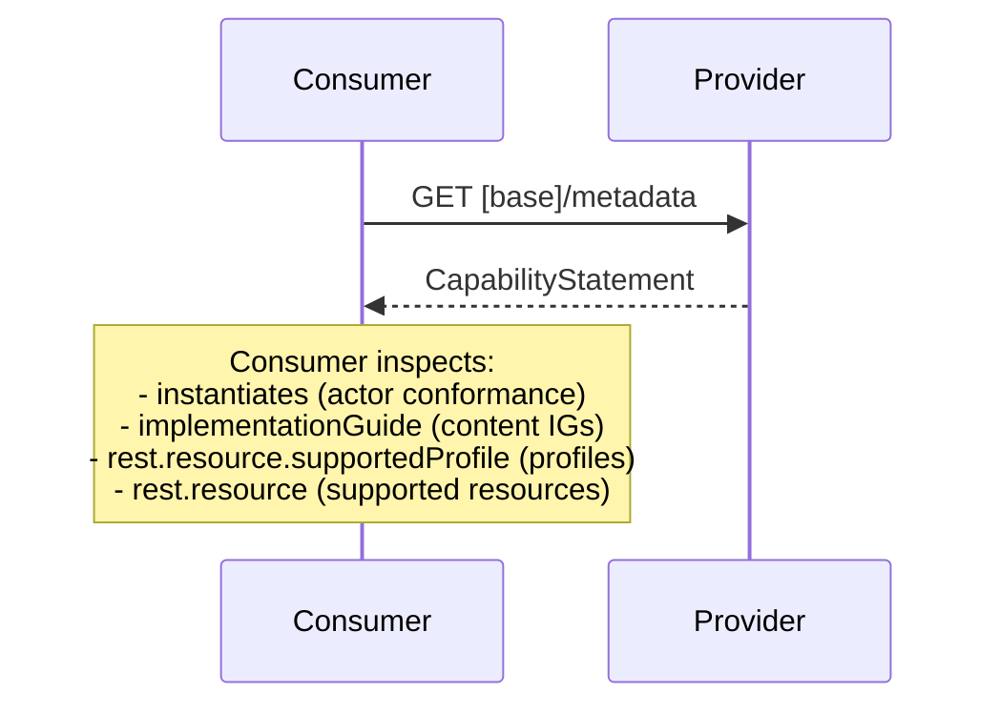

### Overview

Systems discover capabilities via FHIR CapabilityStatement (`GET /metadata`). Consumers inspect a provider's functionality before attempting transactions.

### Transaction

Capability discovery uses the standard FHIR capabilities interaction:

```
GET [base]/metadata
```

Consumers interpret the CapabilityStatement by inspecting:
- `instantiates` — actor conformance (which EEHRxF actors the server implements)
- `implementationGuide` — content IGs supported (which priority categories are available)
- `rest.resource.supportedProfile` — profiles the server produces
- `rest.resource` — supported resource types and interactions
- `fhirVersion` — FHIR version

### Provider Actors

Different provider actors advertise different capabilities:

- **Document Access Provider**: Advertises document exchange capabilities (MHD ITI-67, ITI-68 transactions; ITI-105 with Document Submission Option)
- **Resource Access Provider**: Advertises resource query capabilities (IPA patterns)

A system may implement one or both.

### Actor Conformance via `instantiates`

Servers declare actor conformance using `CapabilityStatement.instantiates`, referencing the normative CapabilityStatements in this IG:

- [Document Access Provider](CapabilityStatement-EEHRxF-DocumentAccessProvider.html)
- [Document Access Provider — Document Submission Option](CapabilityStatement-EEHRxF-DocumentAccessProvider-SubmissionOption.html)
- [Grouped Document Publisher/Access Provider](CapabilityStatement-EEHRxF-DocumentPublisherAccessProvider.html)
- [Resource Access Provider](CapabilityStatement-EEHRxF-ResourceAccessProvider.html)

Consumers inspect `instantiates` to determine which actor roles and exchange patterns a server supports.

Servers MAY also list universal-realm CapabilityStatements (e.g., the [IPA Server](http://hl7.org/fhir/uv/ipa/CapabilityStatement/ipa-server)) alongside EEHRxF actors. A server conformant to IPA that also conforms to EEHRxF Resource Access Provider requirements declares both. This avoids EU-locking capability declarations for functionality with broad applicability outside the EU context.

### Priority Category Support

The EHDS ANNEX II priority categories are:

- European Patient Summary (EPS)
- Medication Prescription & Dispense (MPD)
- Laboratory Results
- Hospital Discharge Reports (HDR)
- Imaging Reports
- Imaging Manifests

**Document access**: Servers declare supported priority categories by listing content IG canonical URLs in `CapabilityStatement.implementationGuide`. Consumers inspect `implementationGuide` then query by `DocumentReference.type` (LOINC). See [Document Exchange](document-exchange.html) for the type codes per priority category. The `.type` codes are LOINC — a universal-realm standard — not EU-specific codes. Servers SHOULD NOT restrict `DocumentReference.type` or `DocumentReference.category` to EU-defined code systems when universal-realm or LOINC codes cover the same concept.

**Resource access (Xt-EHR D8.1 Resource Interoperability Profiles)**: Servers supporting IPA-aligned resource access declare conformance via `instantiates` referencing the IPA server CapabilityStatement (`http://hl7.org/fhir/uv/ipa/CapabilityStatement/ipa-server`) and the EEHRxF Resource Access Provider CapabilityStatement. Per-resource profile support appears in `rest.resource.supportedProfile`. See [Resource Access](resource-access.html).

A server may support document access, resource access, or both.

### Profile Declarations

The normative CapabilityStatements in this IG declare `supportedProfile` on:

- **DocumentReference** — the [EEHRxF MHD DocumentReference](StructureDefinition-EehrxfMhdDocumentReference.html) profile and the base [MHD DocumentReference](https://profiles.ihe.net/ITI/MHD/StructureDefinition-IHE.MHD.Minimal.DocumentReference.html) profiles
- **Patient** — the [EU Core Patient](http://hl7.eu/fhir/base/StructureDefinition/patient-eu-core) profile

These tell consumers which resource profiles to expect.

### Example Capability Discovery Flow



### Example: Document Access Provider (Multiple Priority Categories)

See the [example CapabilityStatement](CapabilityStatement-EEHRxF-DocumentAccessProvider-Example.html) for a Document Access Provider serving Patient Summaries and Laboratory Reports.

Key elements:

```json
{
  "instantiates": [
    "https://hl7.eu/fhir/health-data-api/CapabilityStatement/EEHRxF-DocumentAccessProvider"
  ],
  "implementationGuide": [
    "http://hl7.eu/fhir/eps",
    "http://hl7.eu/fhir/laboratory"
  ],
  "rest": [{
    "resource": [{
      "type": "DocumentReference",
      "supportedProfile": [
        "https://hl7.eu/fhir/health-data-api/StructureDefinition/EehrxfMhdDocumentReference",
        "https://profiles.ihe.net/ITI/MHD/StructureDefinition/IHE.MHD.Minimal.DocumentReference"
      ]
    }]
  }]
}
```

### Example: Resource Access Provider (IPA-Aligned)

A server supporting resource-level access (Xt-EHR D8.1 Resource Interoperability Profiles) declares:

```json
{
  "instantiates": [
    "http://hl7.org/fhir/uv/ipa/CapabilityStatement/ipa-server",
    "https://hl7.eu/fhir/health-data-api/CapabilityStatement/EEHRxF-ResourceAccessProvider"
  ],
  "rest": [{
    "resource": [
      {
        "type": "Condition",
        "supportedProfile": [
          "https://hl7.eu/fhir/base/StructureDefinition/Condition-eu-core"
        ]
      },
      {
        "type": "Observation",
        "supportedProfile": [
          "https://hl7.eu/fhir/base/StructureDefinition/Observation-eu-core"
        ]
      }
    ]
  }]
}
```

Consumers inspect `instantiates` to determine which actor roles a server supports. A server may implement document access, resource access, or both.

### See Also
- [FHIR CapabilityStatement](https://hl7.org/fhir/R4/capabilitystatement.html)
- [Actors and Transactions](actors.html)
- [IHE MHD](https://profiles.ihe.net/ITI/MHD/)
- [Document Exchange](document-exchange.html)
- [Resource Access](resource-access.html)
- [IPA Server CapabilityStatement](https://hl7.org/fhir/uv/ipa/CapabilityStatement-ipa-server.html)
