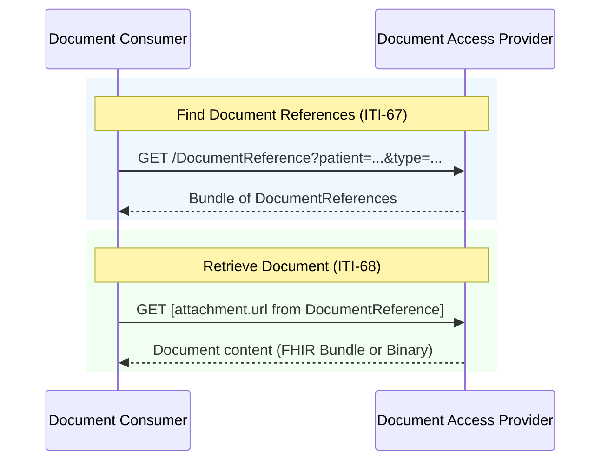

### Overview

Document exchange using IHE MHD (Mobile Health Documents) transactions. This IG inherits MHD transactions as-is, with constraints specific to EEHRxF content.

### Actors and Transactions

This IG defines three document exchange actors. See [Actors](actors.html) for detailed actor groupings.

| Actor | Transaction | Optionality |
|-------|-------------|-------------|
| [Document Consumer](actors.html#document-consumer) | [ITI-67](https://profiles.ihe.net/ITI/MHD/ITI-67.html) Find Document References | R |
| [Document Consumer](actors.html#document-consumer) | [ITI-68](https://profiles.ihe.net/ITI/MHD/ITI-68.html) Retrieve Document | R |
| [Document Access Provider](actors.html#document-access-provider) | [ITI-67](https://profiles.ihe.net/ITI/MHD/ITI-67.html) Find Document References | R |
| [Document Access Provider](actors.html#document-access-provider) | [ITI-68](https://profiles.ihe.net/ITI/MHD/ITI-68.html) Retrieve Document | R |
| [Document Access Provider](actors.html#document-access-provider) | [ITI-105: Simplified Publish](https://profiles.ihe.net/ITI/MHD/ITI-105.html) | O |
| [Document Publisher](actors.html#document-publisher) | [ITI-105: Simplified Publish](https://profiles.ihe.net/ITI/MHD/ITI-105.html) | R |
{: .grid}


---

### Document Consumption

The primary workflow is **query and retrieve**: Document Consumers find documents via ITI-67, then retrieve content via ITI-68.

#### Sequence Diagram



#### Document Content

ITI-68 retrieves the document from the URL specified in `DocumentReference.content.attachment.url`. The URL format may depend on the document type:

| Document Format | attachment.url | Content-Type |
|-----------------|----------------|--------------|
| FHIR Document (Patient Summary, etc.) | `/Bundle/[id]` | `application/fhir+json` or `application/fhir+xml` |
| PDF and other non-FHIR | `/Binary/[id]` | `application/pdf`, etc. |
{: .grid}


[ITI-68](https://profiles.ihe.net/ITI/MHD/ITI-68.html) retrieves the document directly from the URL. FHIR Documents are returned as Bundle resources when `Accept: application/fhir+json` is specified.

> **Authorization Scope:** The required scope depends on the document format. For non-FHIR documents (PDF), use `system/Binary.read`. For FHIR Documents, use `system/Bundle.read`.

#### Document Search Strategy

This IG follows the [IHE Document Sharing](https://profiles.ihe.net/ITI/HIE-Whitepaper/index.html) approach:

1. **category** (coarse search): Broad classification based on content use
2. **type** (clinical precision): Specific document types, typically LOINC codes

These two elements are typically profiled by a clinical document content profile for the use of making that document content discoverable. Further under some network constraints these two elements can only carry one concept (cardionality of ..1).

##### Category Values (EHDS Priority Categories)

The EHDS priority categories are defined by [Article 14 of the EHDS Regulation](https://eur-lex.europa.eu/eli/reg/2025/327/oj#d1e2289-1-1). We define codes specifically for EEHRxF that map directly to these regulatory categories. These codes are specific to the EHDS Regulation and thus are driven by that definition and intention. See [EEHRxFDocumentPriorityCategoryCS](CodeSystem-eehrxf-document-priority-category-cs.html) for the complete list. These categories are provided as informative codes to guide linkage to clinical codes that are used and would be considered within that priority category.

Given that the `DocumentReference.type` and `DocumentReference.category` are controlled by a clinical document content profile, we can not place the EHDS priority category into those elements. These clinical document content profiles do have well defined `type` values that we can group into the EHDS priority category. We provide both ValueSet grouping, and ConceptMap grouping for this purpose.

We provide two methods to link between the priority category and clinical `type` codes:

A set of ValueSet [`EEHRxFDocumentTypeVS`](ValueSet-EEHRxFDocumentTypeVS.html) includes all clinical `type` codes (LOINC) that are relevant to EHDS priority categories, with a `useContext` indicating the corresponding priority `category`.
- `Patient-Summaries` codes are found in [EEHRxFDocumentTypePatientSummaryVS](ValueSet-EEHRxFDocumentTypePatientSummaryVS.html)
- `Discharge-Reports` codes are found in [EEHRxFDocumentTypeDischargeReportVS](ValueSet-EEHRxFDocumentTypeDischargeReportVS.html)
- `Laboratory-Reports` codes are found in [EEHRxFDocumentTypeLaboratoryReportVS](ValueSet-EEHRxFDocumentTypeLaboratoryReportVS.html)
- `Medical-Imaging` codes are found in [EEHRxFDocumentTypeMedicalImagingVS](ValueSet-EEHRxFDocumentTypeMedicalImagingVS.html)

A ConceptMap [EehrxfMhdDocumentReferenceCM](ConceptMap-EehrxfMhdDocumentReferenceCM.html) maps the same set of clinical `type` codes to their corresponding priority `category`.

The priority category of `Electronic-Prescriptions` and `Electronic-Dispensations` are not considered appropriate use-cases for documents, and thus have no associated document types.

The above valueSets and ConceptMap are authorative. As of now, the following `type` codes are grouped into the EHDS priority categories 

| priority category | types | categories | relevant IGs |
|-------------------|--------------|-------|------------|
| Patient-Summaries | 60591-5 | none | [Europe Patient Summary](https://build.fhir.org/ig/hl7-eu/eps/) 
| Discharge-Reports | 34105-7 | none | [Hospital Discharge Report](https://build.fhir.org/ig/hl7-eu/hdr/) 
| Laboratory-Reports | 11502-2 | (0..*) 11502-2, 18717-9, 18719-5, 18722-9, 18723-7, 18725-2, 18728-6, 26436-6 | [Europe Laboratory Report](https://hl7.eu/fhir/laboratory/) 
| Medical-Imaging | 85430-7 | `Medical-Imaging` | [Europe Imaging Reports](https://build.fhir.org/ig/hl7-eu/imaging-r4/en/)
{: .grid}

#### Search Examples

The examples below show queries using `type` (LOINC document type), as that is the most specific and reliable way to identify document types.

Searching by `type` (LOINC) is recommended for most accurate results. For a given EHDS priority category, look to the valueSet associated with that priority category code, or look to the ConceptMap, to find the relevant `type` codes to use in the search. If more than one `type` code is relevant, include them all in the search to ensure you find all relevant documents.

Including the EHDS priority category code in a search against `category` may help discover new document `type`s that are available but not yet cross-referenced here.

These examples assume the consumer has resolved the patient to a FHIR resource reference (e.g. `Patient/123`) via [Patient Matching](patient-match.html). As an alternative, consumers can search by patient identifier directly using [chained identifier search](patient-match.html#option-chained-identifier-search) (e.g. `patient.identifier=[system]|[value]`).

##### Patient Summary

By type (LOINC):
```
GET [base]/DocumentReference?patient=Patient/123&type=http://loinc.org|60591-5&status=current
```

##### Medical Test Results (Laboratory)

By type (LOINC):
```
GET [base]/DocumentReference?patient=Patient/123&type=http://loinc.org|11502-2&status=current
```

##### Imaging Reports and Manifests

By type (LOINC - imaging reports only):
```
GET [base]/DocumentReference?patient=Patient/123&type=http://loinc.org|85430-7&status=current
```

##### Hospital Discharge Reports

By type (LOINC):
```
GET [base]/DocumentReference?patient=Patient/123&type=http://loinc.org|18842-5,http://loinc.org|100719-4&status=current
```

---

### Document Publication

When Document Publisher and Document Access Provider are **separate systems**, the Publisher submits documents using [ITI-105 Simplified Publish](https://profiles.ihe.net/ITI/MHD/ITI-105.html) per the [MHD Simplified Publish Option](https://profiles.ihe.net/ITI/MHD/1332_actor_options.html#13324-simplified-publish-option). When they are **grouped** (co-located), publication is internal.

#### Document Submission Option

The Document Access Provider MAY support receiving documents from external Publishers by implementing the [MHD Simplified Publish Option](https://profiles.ihe.net/ITI/MHD/1332_actor_options.html#13324-simplified-publish-option). This is the **Document Submission Option**.

Systems implementing this option declare it via [EEHRxF-DocumentAccessProvider-SubmissionOption](CapabilityStatement-EEHRxF-DocumentAccessProvider-SubmissionOption.html). See [Actors - Document Submission Option](actors.html#document-submission-option) for actor groupings.

#### ITI-105 Simplified Publish

```
POST [base]/DocumentReference
Content-Type: application/fhir+json

{
  "resourceType": "DocumentReference",
  "status": "current",
  "type": { ... },
  "subject": { "reference": "Patient/123" },
  "content": [{
    "attachment": {
      "contentType": "application/fhir+json",
      "data": "[base64-encoded document]"
    }
  }]
}
```

The server validates, extracts, and persists the document, returning the created DocumentReference with server-assigned IDs. See [IHE MHD ITI-105](https://profiles.ihe.net/ITI/MHD/ITI-105.html) for details.

> **How ITI-105 handles document content:** Per [MHD ITI-105 Expected Actions](https://profiles.ihe.net/ITI/MHD/ITI-105.html), the Document Recipient extracts the document from `attachment.data` and persists it such that it is retrievable via `attachment.url`. This means consumers querying via ITI-67 receive DocumentReferences with URLs pointing to `/Bundle/[id]` (for FHIR Documents) or `/Binary/[id]` (for PDFs, DICOM), and ITI-68 retrieval returns the native document format—not base64.

#### Other Publication Transactions

This IG specifies ITI-105 as the publication mechanism for Document Publishers submitting to external Access Providers. ITI-105 provides a single publication pattern that handles all EHDS content types (FHIR Documents, legacy PDFs, and DICOM manifests) while keeping publisher implementation simple—the Document Access Provider handles normalization on ingest, ensuring consumers always retrieve native document formats via ITI-67/ITI-68.

Member states or local deployments MAY additionally support:

- **[ITI-65 Provide Document Bundle](https://profiles.ihe.net/ITI/MHD/ITI-65.html)**: For XDS-centric ecosystems requiring explicit SubmissionSet metadata or multi-document submission.
- **[ITI-106 Generate Metadata](https://profiles.ihe.net/ITI/MHD/ITI-106.html)**: For structured document publishers wanting server-generated DocumentReference.

These are not required for conformance to the actors within the scope of this implementation guide.

#### Patient Identity in Document Publication

This specification does not require a patient lookup step before publication — how the publisher obtains the patient identifier is up to the implementer. Per [MHD ITI-105 §Patient Identity](https://profiles.ihe.net/ITI/MHD/ITI-105.html#231054122-patient-identity):

> A Patient Reference to a commonly accessible server may be obtained through use of PDQm, PIXm, PMIR, or by some other means. A commonly accessible logical reference using Patient Identifier, instead of a literal reference, may be acceptable where there is a common Identifier, such as a national individual identifier.

---

### References

- [IHE MHD Specification](https://profiles.ihe.net/ITI/MHD/)
- [IHE Document Sharing](https://profiles.ihe.net/ITI/HIE-Whitepaper/index.html)
- [Actors and Transactions](actors.html)
