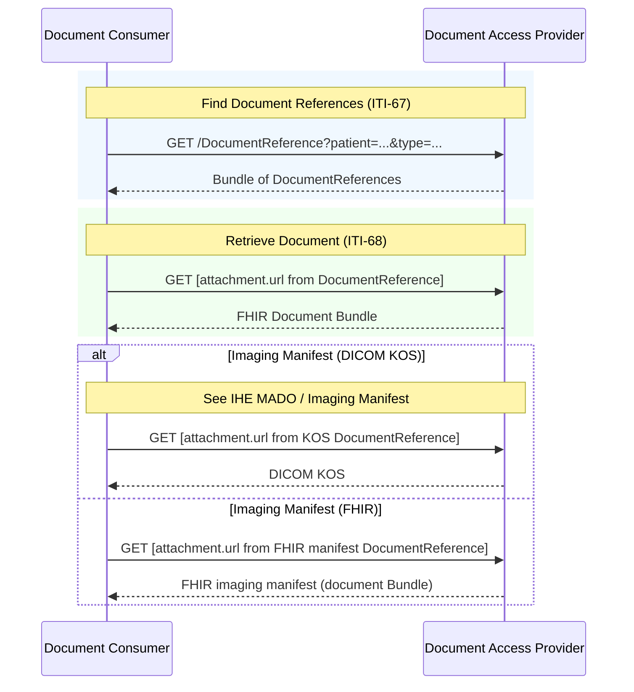

### Overview

Document exchange using IHE MHD (Mobile Health Documents) transactions. This IG inherits MHD transactions as-is, with constraints specific to EEHRxF content.

For how different server backends (FHIR-native on-demand vs persisted/XDS-bridge) implement these transactions, see [Relationship to XDS/FHIR Document Sharing](background-xds-fhir.html).

<div>
<figure class="figure">

<figcaption class="figure-caption"><strong>Figure: Document Exchange Overview</strong></figcaption>
</figure>
</div>

### Actors and Transactions

This IG defines three document exchange actors. See [Actors](actors.html) for detailed actor groupings.

| Actor | Transaction | Optionality |
|-------|-------------|-------------|
| [Document Consumer](actors.html#document-consumer) | [ITI-67](https://profiles.ihe.net/ITI/MHD/ITI-67.html) Find Document References | R |
| [Document Consumer](actors.html#document-consumer) | [ITI-68](https://profiles.ihe.net/ITI/MHD/ITI-68.html) Retrieve Document | R |
| [Document Access Provider](actors.html#document-access-provider) | [ITI-67](https://profiles.ihe.net/ITI/MHD/ITI-67.html) Find Document References | R |
| [Document Access Provider](actors.html#document-access-provider) | [ITI-68](https://profiles.ihe.net/ITI/MHD/ITI-68.html) Retrieve Document | R |
| [Document Access Provider](actors.html#document-access-provider) | [ITI-105: Simplified Publish](https://profiles.ihe.net/ITI/MHD/ITI-105.html) | O |
| [Document Publisher](actors.html#document-publisher) | [ITI-105: Simplified Publish](https://profiles.ihe.net/ITI/MHD/ITI-105.html) | R |
{: .grid}


---

### Document Consumption

The primary workflow is **query and retrieve**: Document Consumers find documents via ITI-67, then retrieve content via ITI-68.

#### Sequence Diagram


```mermaid
sequenceDiagram
    participant Consumer as Document Consumer
    participant Provider as Document Access Provider

    rect rgb(240, 248, 255)
    Note over Consumer,Provider: Find Document References (ITI-67)
    Consumer->>Provider: GET /DocumentReference?patient=...&type=...
    Provider-->>Consumer: Bundle of DocumentReferences
    end

    rect rgb(240, 255, 240)
    Note over Consumer,Provider: Retrieve Document (ITI-68)
    Consumer->>Provider: GET [attachment.url from DocumentReference]
    Provider-->>Consumer: FHIR Document Bundle
    end

    alt Imaging Manifest (DICOM KOS)
    Note over Consumer,Provider: See IHE MADO / Imaging Manifest
    Consumer->>Provider: GET [attachment.url from KOS DocumentReference]
    Provider-->>Consumer: DICOM KOS
    else Imaging Manifest (FHIR)
    Consumer->>Provider: GET [attachment.url from FHIR manifest DocumentReference]
    Provider-->>Consumer: FHIR imaging manifest (document Bundle)
    end
```

#### Document Content

[ITI-68](https://profiles.ihe.net/ITI/MHD/ITI-68.html) retrieves the document from the URL in `DocumentReference.content.attachment.url`. Consumers identify the content using two DocumentReference elements:

- **`type`** (LOINC code) — identifies the clinical document type and which [content IG](priority-categories.html) applies.
- **`attachment.contentType`** — identifies the technical format.

Here these elements are read as **metadata** on a retrieved DocumentReference, describing its content. Document discovery uses search parameters (see [Document Search Strategy](#document-search-strategy)); `type` is both a metadata element and a search parameter, while `contentType` is metadata only and is not a search axis in this IG.

Together, these tell the consumer what the retrieved document contains. The patterns below are illustrative, not exhaustive — other content profiles and formats may apply per the relevant content IG.

| Content Pattern | `attachment.contentType` | Retrieved Content | Example |
|---|---|---|---|
| FHIR Document | `application/fhir+json` or `application/fhir+xml` | FHIR Document Bundle (`Bundle.type = "document"`) | `/Bundle/[id]` |
| FHIR imaging manifest | `application/fhir+json` or `application/fhir+xml` | FHIR document Bundle (`Bundle.type = "document"`) | `/Bundle/[id]` |
| FHIR collection | `application/fhir+json` or `application/fhir+xml` | FHIR Bundle (`Bundle.type = "collection"`) | `/Bundle/[id]` |
| Non-FHIR | `application/dicom` | Binary content (DICOM KOS) | `/Binary/[id]` |
{: .grid}

Servers SHALL return content conforming to FHIR Document content profiles as a native FHIR Document Bundle, not wrapped in Binary. `Bundle.type` is not constrained to `document` in general — content profiles MAY define a `collection` Bundle. For DICOM KOS imaging manifests ([IHE MADO](priority-area-imaging-manifest.html#ihe-mado)), standard MHD behavior applies.

`attachment.url` is an opaque retrieval URL — its format is unconstrained. Servers host content at any endpoint they choose. The examples above (`/Bundle/[id]`, `/Binary/[id]`) illustrate common patterns, not requirements.

Human-readable representations (e.g. PDF narrative) are part of the FHIR Document as defined by the relevant [content IG](priority-categories.html) — not exposed at metadata level as separate DocumentReferences. EHDS top-level document exchange requires structured content; a PDF is not a conformant top-level document on its own. A separate PDF Binary referenced by its own DocumentReference is a valid FHIR pattern but does not satisfy EHDS conformance at the exchange surface.

**Dual-representation pattern.** When the same content has two technical encodings, publish two DocumentReferences linked via `relatesTo.code = transforms` and let consumers select by `contentType`. The [imaging manifest](priority-area-imaging-manifest.html#dual-documentreference-pattern-mado) (FHIR + DICOM KOS) is the canonical case; the pattern applies to any content with EHDS-conformant alternative encodings. It does not legitimize a PDF-only representation as a conformant top-level document.

#### Document Search Strategy

[IHE Document Sharing](https://profiles.ihe.net/ITI/HIE-Whitepaper/index.html) distinguishes `type` (specific document types, typically LOINC codes) from `category` (broad classification) on DocumentReference. This IG supports discovery on both: `type` for precise queries (preferred binding) and `category` for coarse, category-only queries.

**Search parameter conformance and metadata commitment are separate axes.** Following MHD ITI-67, the Document Access Provider SHALL accept all declared search parameters but is not required to populate every corresponding metadata element on returned DocumentReferences. A server returning Minimal-profile DocumentReferences may accept queries on parameters like `setting`, `facility`, `event`, `security-label`, or `related` and legitimately return empty results when the underlying data is not indexed for those facets. Consumers should be robust to this per [ITI-67 §2:3.67.4.2.3](https://profiles.ihe.net/ITI/MHD/ITI-67.html#2367423): *"the response may contain DocumentReference Resources that match the query parameters but are not compliant with the DocumentReference constraints defined here."*

##### EHDS Priority Categories and Type Codes

[Article 14](https://eur-lex.europa.eu/eli/reg/2025/327/oj#d1e2289-1-1) of the EHDS regulation defines six priority categories of electronic health data. Four travel as documents and carry an EHDS priority category code on `category`, drawn from LOINC Document Class codes ([EhdsPriorityCategoryEuApiVS](ValueSet-ehds-priority-category-eu-api.html)). Each maps to the precise LOINC `type` codes consumers use for document search.

`category` and `type` are distinct axes: `category` is the broad EHDS classification for coarse discovery; `type` is the specific document type for precise discovery. `category` is bound extensible and `type` preferred to LOINC value sets — justified EHDS guidance, not locked, so broader codings stay conformant. Content IGs may define their own typing. Patient Summary is the one case where a fixed `type` (`60591-5`) aids consistent identification.

Each category code maps to example LOINC `type` codes:
- `34133-9` Summary of episode note → [DocumentTypePatientSummaryEuApiVS](ValueSet-document-type-patient-summary-eu-api.html)
- `18842-5` Discharge summary → [DocumentTypeDischargeReportEuApiVS](ValueSet-document-type-discharge-report-eu-api.html)
- `26436-6` Laboratory studies (set) → [DocumentTypeLaboratoryReportEuApiVS](ValueSet-document-type-laboratory-report-eu-api.html)
- `18726-0` Radiology studies (set) → [DocumentTypeMedicalImagingEuApiVS](ValueSet-document-type-medical-imaging-eu-api.html)

The type ValueSets list example codes, not an exhaustive set. Content IGs are the authoritative source. ePrescription and eDispensation do not travel as documents and have no category or type codes here.

[DocumentTypeEuApiVS](ValueSet-document-type-eu-api.html) aggregates the per-category type codes into one ValueSet bound (preferred) to `DocumentReference.type`. A [ConceptMap](ConceptMap-document-reference-category-type-eu-api.html) gives the category-to-type mapping in machine-readable form.

**Category-based discovery.** Consumers MAY search by `category` alone to retrieve all documents in a priority category without naming each LOINC `type` code:

```
GET [base]/DocumentReference?patient=Patient/123&category=http://loinc.org|26436-6&status=current
```

`category` is bound **extensible** to [EhdsPriorityCategoryEuApiVS](ValueSet-ehds-priority-category-eu-api.html). It is one element (`0..1`, MHD Minimal cap), but its `coding` is `0..*` — so a single `category` carries multiple codings (EHDS priority LOINC plus XDS classCode, SNOMED, or national) for multi-scheme categorization.

| priority category (`category`) | type codes (`type`) | relevant IGs |
|-------------------|------------|--------------|
| 34133-9 Summary of episode note | 60591-5 | [Europe Patient Summary](https://build.fhir.org/ig/hl7-eu/eps/) |
| 18842-5 Discharge summary | 18842-5, 100719-4 | [Hospital Discharge Report](https://build.fhir.org/ig/hl7-eu/hdr/) |
| 26436-6 Laboratory studies (set) | 11502-2 | [Europe Laboratory Report](https://hl7.eu/fhir/laboratory/) |
| 18726-0 Radiology studies (set) | 85430-7, 18748-4 | [Europe Imaging Reports](https://build.fhir.org/ig/hl7-eu/imaging-r5/en/) |
{: .grid}

#### Search Examples

Search by `type` (LOINC) for the most accurate results. To find the relevant `type` codes for a priority category, consult the per-category ValueSet or the ConceptMap. When multiple `type` codes apply, include all of them.

These examples assume the consumer has resolved the patient to a FHIR reference (e.g., `Patient/123`) via [Patient Matching](patient-match.html). Alternatively, use [chained identifier search](patient-match.html#option-chained-identifier-search) (e.g., `patient.identifier=[system]|[value]`).

##### Patient Summary

By category (EHDS priority category, coarse):
```
GET [base]/DocumentReference?patient=Patient/123&category=http://loinc.org|34133-9&status=current
```

By type (LOINC):
```
GET [base]/DocumentReference?patient=Patient/123&type=http://loinc.org|60591-5&status=current
```

##### Medical Test Results (Laboratory)

By type (LOINC):
```
GET [base]/DocumentReference?patient=Patient/123&type=http://loinc.org|11502-2&status=current
```

##### Imaging Reports and Manifests

By type (LOINC — imaging reports):
```
GET [base]/DocumentReference?patient=Patient/123&type=http://loinc.org|85430-7&status=current
```

By type (LOINC — imaging study manifests):
```
GET [base]/DocumentReference?patient=Patient/123&type=http://loinc.org|18748-4&status=current
```

> Imaging manifests may use the [dual-DocumentReference pattern](priority-area-imaging-manifest.html#dual-documentreference-pattern-mado): two DocumentReferences (FHIR and DICOM KOS) linked via `relatesTo.transforms`. Consumers select the representation they support based on `contentType`.

##### Hospital Discharge Reports

By type (LOINC):
```
GET [base]/DocumentReference?patient=Patient/123&type=http://loinc.org|18842-5,http://loinc.org|100719-4&status=current
```

---

### Document Publication

When Document Publisher and Document Access Provider are **separate systems**, the Publisher submits documents using [ITI-105 Simplified Publish](https://profiles.ihe.net/ITI/MHD/ITI-105.html) per the [MHD Simplified Publish Option](https://profiles.ihe.net/ITI/MHD/1332_actor_options.html#13324-simplified-publish-option). When they are **grouped** (co-located), publication is internal.

#### Document Submission Option

The Document Access Provider MAY support receiving documents from external Publishers by implementing the [MHD Simplified Publish Option](https://profiles.ihe.net/ITI/MHD/1332_actor_options.html#13324-simplified-publish-option). This is the **Document Submission Option**.

Systems implementing this option declare it via [Document Access Provider - Document Submission Option](CapabilityStatement-document-access-provider-submission-option-eu-api.html). See [Actors - Document Submission Option](actors.html#document-submission-option) for actor groupings.

#### ITI-105 Simplified Publish

```
POST [base]/DocumentReference
Content-Type: application/fhir+json

{
  "resourceType": "DocumentReference",
  "status": "current",
  "type": { ... },
  "subject": { "reference": "Patient/123" },
  "content": [{
    "attachment": {
      "contentType": "application/fhir+json",
      "data": "[base64-encoded document]"
    }
  }]
}
```

The server validates, extracts, and persists the document, returning the created DocumentReference with server-assigned IDs. See [IHE MHD ITI-105](https://profiles.ihe.net/ITI/MHD/ITI-105.html) for details.

> **Publish shape vs query shape.** Publication and query use different DocumentReference shapes. At publish time the wire shape is [MHD SimplifiedPublish](https://profiles.ihe.net/ITI/MHD/StructureDefinition-IHE.MHD.SimplifiedPublish.DocumentReference.html) (`content.attachment.data` present, no `url`). The persisted, queried shape is [DocumentReferenceEuApi](StructureDefinition-document-reference-eu-api.html), parented on MHD Minimal. ITI-105 is the publication path; the server transforms the submitted resource into the persisted form served via ITI-67/ITI-68.

> **Document content:** Per MHD ITI-105, the server extracts the document from `attachment.data` and persists it so that consumers can retrieve it via `attachment.url`. This IG requires that servers SHALL return FHIR Documents as native FHIR Document Bundles — not wrapped in Binary. The `attachment.url` format is unconstrained; servers host documents at any endpoint they choose.

#### Other Publication Transactions

This IG specifies ITI-105 as the publication mechanism for Document Publishers that submit to external Access Providers. ITI-105 gives publishers a single publication pattern for content conforming to EHDS priority category content profiles. The Document Access Provider handles persistence on ingest, so consumers retrieve documents in their native format via ITI-67/ITI-68.

Member states or local deployments MAY additionally support:

- **[ITI-65 Provide Document Bundle](https://profiles.ihe.net/ITI/MHD/ITI-65.html)**: For XDS-centric ecosystems requiring explicit SubmissionSet metadata or multi-document submission.
- **[ITI-106 Generate Metadata](https://profiles.ihe.net/ITI/MHD/ITI-106.html)**: For structured document publishers wanting server-generated DocumentReference.

These are not required for conformance to the actors within the scope of this implementation guide.

#### Document Lifecycle

Update and withdrawal use native FHIR DocumentReference semantics, not XDS SubmissionSet machinery. A new version supersedes a prior document via `DocumentReference.relatesTo` (`code = replaces`); the prior `DocumentReference.status` becomes `superseded`. Withdrawal sets `status` to `entered-in-error`. The FHIR resource graph carries the relationships that XDS SubmissionSets expressed, so this IG does not import SubmissionSet metadata.

#### Patient Identity in Document Publication

This specification does not require a patient lookup step before publication — how the publisher obtains the patient identifier is up to the implementer. Per [MHD ITI-105 §Patient Identity](https://profiles.ihe.net/ITI/MHD/ITI-105.html#231054122-patient-identity):

> A Patient Reference to a commonly accessible server may be obtained through use of PDQm, PIXm, PMIR, or by some other means. A commonly accessible logical reference using Patient Identifier, instead of a literal reference, may be acceptable where there is a common Identifier, such as a national individual identifier.

---

### References

- [IHE MHD Specification](https://profiles.ihe.net/ITI/MHD/)
- [IHE Document Sharing](https://profiles.ihe.net/ITI/HIE-Whitepaper/index.html)
- [Actors and Transactions](actors.html)
