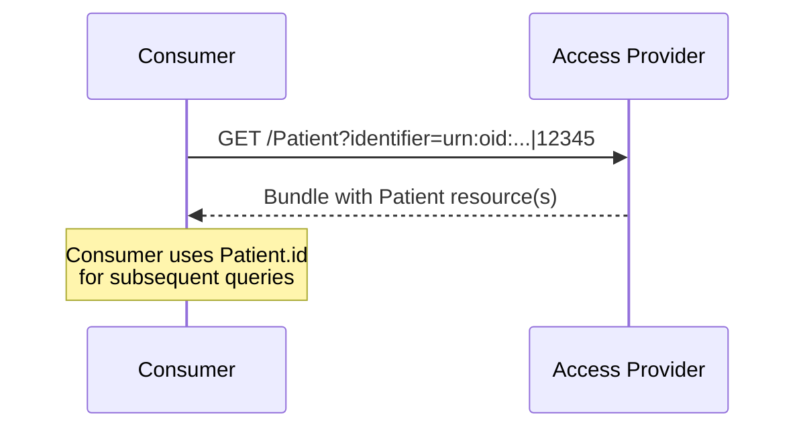

### Overview

Patient lookup using IHE PDQm (Patient Demographics Query for Mobile). This transaction allows consumers to locate the correct Patient resource on a provider before querying for health information.

This specification inherits directly from [IHE PDQm](https://profiles.ihe.net/ITI/PDQm/index.html) with one constraint: the `identifier` search parameter is required for patient search.

Patient.Search should be used when a patient identifier (e.g. National ID) is available and trusted. If an identifier is not available, Patient.$match should be used to perform a demographics search operation.

### Actor Roles

| Actor | Role |
|-------|------|
| Consumer | Find a patient record in the Access Provider system based on identifier or demographics information |
| Document/Resource Access Provider | Return its patient record information based on identifier or demographics queries from a consumer. |

### Transaction Options

Providers support one or both of the following patient identification mechanisms:

#### Mobile Patient Demographics Query [ITI-78] (Required)

Patient search using the [IHE PDQm ITI-78](https://profiles.ihe.net/ITI/PDQm/ITI-78.html) transaction. This specification constrains ITI-78 to require the `identifier` parameter.

```
GET [base]/Patient?identifier=[system]|[value]
```

This approach covers the majority of European use cases where patient identifiers (MRN, national ID) are available.

**Required Search Parameters:**

Both Provider and Consumer SHALL support the `identifier` parameter for patient search.

| Parameter | Type | Expectation | Description |
|-----------|------|-------------|-------------|
| identifier | token | SHALL | Patient identifier (e.g., national ID, MRN) |

**Optional Search Parameters:**

Providers MAY support additional PDQm search parameters per [ITI-78](https://profiles.ihe.net/ITI/PDQm/ITI-78.html):

| Parameter | Type | Expectation | Description |
|-----------|------|-------------|-------------|
| family | string | SHOULD | Patient family name |
| given | string | SHOULD | Patient given name |
| birthdate | date | SHOULD | Patient date of birth |
| _id | token | SHOULD | Patient logical ID |


#### Patient Demographics Match [ITI-119] (Optional)

The Patient Demographics $match option can be used to identify a patient when an identifier-based lookup is not possible (e.g., scenarios where the consumer does not know the patient's local identifier).
The Patient $match operation identifies a patient record given demograpics data (Name, Birthdate, ...) using [IHE PDQm ITI-119](https://profiles.ihe.net/ITI/PDQm/ITI-119.html): 

```
POST [base]/Patient/$match
```

The request body contains a Parameters resource with demographic information. The server responds with candidate matches and confidence scores.

**Required Search Parameters:**


| Parameter | Type | Expectation | Description |
|-----------|------|-------------|-------------|
| onlyCertainMatches | boolean | SHALL | This parameter SHALL be set to true |

In order to support safe clinical patient matching both Provider and Consumer SHALL support the `onlyCertainMatches` parameter which SHALL be set to `true` to indicate that the Consumer would only like matches returned when they are certain to be matches for the subject of the request.

Matching algorithms are product and deployment-specific and may reflect national or region-specific factors (e.g., availability of common demographics, name transliteration, required fields in national patient registries). This specification does not prescribe how matching works, consistent with [PDQm ITI-119](https://profiles.ihe.net/ITI/PDQm/ITI-119.html#231194224-quality-of-match).

### Provider Requirements

| Actor | Transaction | Optionality |
|-------|-------------|-------------|
| Consumer | Mobile Patient Demographics Query [ITI-78] | O |
|  | Patient Demographics Match [ITI-119] | O |
| Provider | Mobile Patient Demographics Query [ITI-78] | R |
|  | Patient Demographics Match [ITI-119] | O |

Providers are RECOMMENDED to implement the $match operation in addition to the patient search for scenarios where identifier is not available.

### Authorization

When grouped with IUA actors:
- Consumer uses Get Access Token [ITI-71] with appropriate scope
- Provider enforces authorization via Incorporate Access Token [ITI-72]

### Example



*Patient lookup applies to both [Document Exchange](document-exchange.html) and [Resource Access](resource-access.html) patterns.*

#### Option: Chained Identifier Search

FHIR also supports querying resources directly by patient identifier via chained search, avoiding a separate lookup step. This applies to both clinical resource queries and document searches (ITI-67):

```
GET [base]/AllergyIntolerance?patient.identifier=[system]|[value]
GET [base]/DocumentReference?patient.identifier=[system]|[value]&type=http://loinc.org|60591-5
```

Chained search can be used to minimize round trips, for example with national aggregating gateways. The Access Provider must support chained search on `patient.identifier` for this to work.

### Design Rationale

In most European exchanges the consumer already holds a trusted patient identifier (national health ID, MRN, or similar). Identifier-based lookup produces an unambiguous match and avoids dependence on demographic data quality, which varies in completeness and localization across member states. The [MyHealth@EU cross-border infrastructure](https://fhir.ehdsi.eu/build/ncp-api/bus-scenario-pat.html) already follows this pattern.

Where an identifier is not available, $match is safer than demographics-based Patient.Search for automated resolution. $match moves resolution to the server, which has richer context (aliases, prior identifiers, phonetic matching) and returns only high-confidence matches when `onlyCertainMatches` is set to `true`. Demographics-based Patient.Search may return multiple candidates for common names, miss near-matches from spelling variation (e.g., "Schroeder" vs. "Schröder"), or produce false matches — and clients have no confidence score to guide selection.

### References

- [IHE PDQm](https://profiles.ihe.net/ITI/PDQm/index.html)
    - [ITI-78 Mobile Patient Demographics Query](https://profiles.ihe.net/ITI/PDQm/ITI-78.html)
    - [ITI-119 Patient Demographics Match](https://profiles.ihe.net/ITI/PDQm/ITI-119.html)
- [FHIR Patient.$match](https://hl7.org/fhir/R4/patient-operation-match.html)
