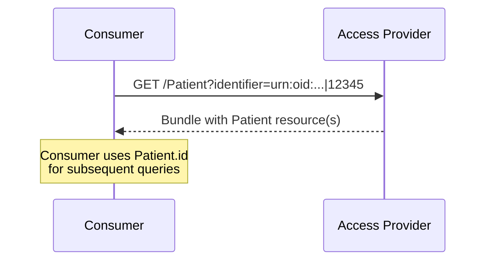

### Overview {#patient-lookup-overview}

Patient lookup is accomplished using IHE PDQm (Patient Demographics Query for Mobile), which relies on core FHIR `Patient.Search` [ITI-78] and `Patient.$match` [ITI-119]. This transaction allows Consumers to locate the correct Patient resource on an Access Provider before querying for health information (documents, resources).

This specification inherits directly from [IHE PDQm](https://profiles.ihe.net/ITI/PDQm/index.html) with one constraint: the `identifier` search parameter is required to be supported for patient search.

#### Conformance Language

This specification uses the same definition of [conformance language](https://hl7.org/fhir/R4/conformance-rules.html#conflang) as the FHIR Core specification.

Additional clarification regarding the use of search parameters:
- The requirement “an actor SHALL support a parameter XY” indicates a general capability and not that this parameter XY must be present for every query.

#### Relationship to the MyHealth@EU IG
The main difference between the two guides is that the EU Health Data API IG describes ways to find patient records based on different parameters whereas the MyHealth@EU uses the patient search transaction for [validation of the patient identity](https://fhir.ehdsi.eu/build/ncp-api/bus-scenario-pat.html) that was acquired via different means (e.g. EUDI Wallet).

Nevertheless, the EU Health Data API implementation guide is aligned as much as possible with the corresponding [patient search transaction](https://fhir.ehdsi.eu/build/ncp-api/sequence-pat.html) from the MyHealth@EU cross-border specification. This includes conformance language and the requirements for search parameters.
If identifiers and/or demographic data of a patient are used as search parameters depends on the agreed identification attributes for a patient of each member state for the cross-border scenario.

#### Patient Lookup Governance

If and how patient lookup transactions are to be used depends on several factors. The European interoperability landscape is quite complex and consists of different deployment scenarios and layers as described on the [implementation overview page](implementation.html).
Apart from the cross-border scenario, the chosen architecture of a member state does have a big influence how the patient lookup transactions are provided and should be used and if they are needed at all. Scenarios like a central national infrastructure with an MPI, federated connected EHR systems or simply the availability of a national identifier lead to different requirements on which systems have to provide and/or use an API for patient lookup and where patient information is actually located:
- on the same server as the document or resource information 
(e.g. access provider = hospital EHR System or clinical data repository...)
- on a different server but in the same network/domain layer 
(e.g. access provider = radiology EHR System for Imaging Report and hospital EHR System for patient information...)
- on a different server and in a different network/domain layer
(e.g. access provider = hospital EHR System or XDS Repository with MHD Facade for documents and MPI for patient information...)

Another factor is which identifying information from a Patient will be used on the document/resource metadata, e.g. on `DocumentReference.subject`:
- A (business) identifier as [logical reference](https://hl7.org/fhir/R4/references.html#logical) in `Reference.identifier`or a reference with Resource id as [literal reference](https://hl7.org/fhir/R4/references.html#literal) in `Reference.reference` (relative or absolute)? 
- will it be the same method for all inner-member state access providers?
- will it be the same for cross-border use cases and inner-member state use cases?

Therefore, **governances** for the various deployment layers (cross-border, national, regional, local) and architectures in place will be needed that define which systems have to provide a patient lookup API, which data is used for lookup transactions (identifiers, demographics, both) or if a patient lookup is needed at all. 

In short:
- not every Document/Resource Access Provider system has to provide a Patient Lookup API, it depends on the national/regional/local architectures which components have to provide it or if it is needed at all
- depending on the governances which identifier(s) are used and in which form, an identifier conversion mechanism might be needed, resulting in the need of doing more than one patient lookup transaction

As conclusion, the pre-condition for EHDS EEHRxF related transactions is, that each client (consumer for pull, producer in case of push) has to know in advance which patient identifying information to use and where to get it from based on the corresponding governances that are relevant for the client. In case of cross-border transactions this responsibility is (already) part of the NCP configuration/behavior.

### Actor Roles

| Actor | Role |
|-------|------|
| Consumer | Find a patient record in the Access Provider system based on identifier or demographics information |
| Document/Resource Access Provider | Return its patient record information based on identifier or demographics queries from a consumer. |

### Transaction Options

Providers support one or both of the following patient identification mechanisms:

#### [ITI-78] Mobile Patient Demographics Query `Patient.Search` - (Required)

Patient search using the [IHE PDQm ITI-78](https://profiles.ihe.net/ITI/PDQm/ITI-78.html) transaction. This specification constrains ITI-78 so that both consumer and provider SHALL support the `identifier` parameter.

```
GET [base]/Patient?identifier=[system]|[value]
```

This approach covers the majority of European use cases for agreed identification attributes for a patient especially where patient identifiers (MRN, national ID) are available.

**Search Parameters:**

Both Provider and Consumer SHALL support the `identifier` parameter for patient search.

| Parameter | Type | Expectation Prov/Cons | Description |
|-----------|------|-------------|-------------|
| identifier | token | SHALL/SHALL | Patient identifier (e.g., national ID, MRN) |


Provider SHALL support all listed parameters below, Consumer SHOULD support them.

| Parameter | Type | Expectation Prov/Cons | Description |
|-----------|------|-------------|-------------|
| _id | token | SHALL/SHOULD | Patient logical ID |
| active | token | SHALL/SHOULD | Wether the patient record is active |
| family | string | SHALL/SHOULD | Patient family name |
| given | string | SHALL/SHOULD | Patient given name |
| telecom | token | SHALL/SHOULD | Telecom details of the patient |
| birthdate | date | SHALL/SHOULD | Patient date of birth |
| address | string | SHALL/SHOULD | A server defined search that may match any of the string fields in the Address, including line, city, district, state, country, postalCode, and/or text |
| address-city | string | SHALL/SHOULD | A city specified in an address |
| address-country | string | SHALL/SHOULD | A country specified in an address |
| address-postalcode | string | SHALL/SHOULD | A postal code specified in an address |
| address-state | string | SHALL/SHOULD | A state specified in an address |
| gender | token | SHALL/SHOULD | Administrative gender of the patient |

While the above search parameters SHALL be supported individually, support for combinations of parameters will be needed for effective searching. Which combinations will be needed depends on the governances for patient lookup as well as on each member state’s agreed identification attributes for a patient.

#### Patient Demographics Match [ITI-119] `Patient.$match`  (Optional)

The Patient $match operation identifies a patient record given demograpics data (Name, Birthdate, ...) and/or identifier using [IHE PDQm ITI-119](https://profiles.ihe.net/ITI/PDQm/ITI-119.html). It returns scored / graded candidates with a search.score and a [match-grade](https://hl7.org/fhir/R4/extension-match-grade.html) informing the client about the match quality.: 

```
POST [base]/Patient/$match
```

The HTTP Body SHALL consist of a FHIR Parameters Resource according to the [PDQm $match OperationDefinition](https://profiles.ihe.net/ITI/PDQm/OperationDefinition-PDQmMatch.html). The `resource` parameter SHALL be set to a Patient Resource containing the demographic information for which the Patient Demographics Consumer desires a match. The server responds with candidate matches and confidence scores.

The Patient Resource in the input parameter `resource` SHALL comply to the [EU Core Profile for Patient](https://hl7.eu/fhir/base/StructureDefinition-patient-eu-core.html).

<div markdown="1" class="stu-note">

**Feedback requested:** 
Is it acceptable to limit the input Patient Resource just to the EU Core Profile?

</div>

**Additional Required Input Parameters:**

| Parameter | Type | Expectation Prov/Cons | Description |
|-----------|------|-------------|-------------|
| onlyCertainMatches | boolean | SHALL/SHALL | This parameter SHALL be set to true |

In order to support safe clinical patient matching both Provider and Consumer SHALL support the `onlyCertainMatches` parameter which SHALL be set to `true` to indicate that the Consumer would only like matches returned when they are certain to be matches for the subject of the request.

Matching algorithms are product and deployment-specific and may reflect national or region-specific factors (e.g., availability of common demographics, name transliteration, required fields in national patient registries). This specification does not prescribe how matching works, consistent with [PDQm ITI-119](https://profiles.ihe.net/ITI/PDQm/ITI-119.html#231194224-quality-of-match).

##### Example

Request: Patient match using a patient resource (which conforms to the EU Core Profile):

```
POST [base]/Patient/$match

{
  "resourceType": "Parameters",
  "id": "example",
  "parameter": [
    {
      "name": "resource",
      "resource": {
        "resourceType" : "Patient",
        "id" : "patient-eu-core-example",
        "meta" : {
          "profile" : [
            "http://hl7.eu/fhir/base/StructureDefinition/patient-eu-core"
          ]
        },
        "identifier": [
          {
            "use": "usual",
            "type": {
              "coding": [
                {
                  "system": "http://hl7.org/fhir/v2/0203",
                  "code": "MR"
                }
              ]
            },
            "system": "urn:oid:1.2.36.146.595.217.0.1",
            "value": "12345"
          }
        ],        
        "name" : [
          {
            "family" : "Doe",
            "given" : [
              "John"
            ]
          }
        ],
        "telecom" : [
          {
            "system" : "phone",
            "value" : "555-1234",
            "use" : "home"
          }
        ],
        "gender" : "male",
        "birthDate" : "1980-01-01",
        "address" : [
          {
            "line" : [
              "123 Example Street"
            ],
            "city" : "Example City",
            "state" : "EX",
            "postalCode" : "12345",
            "country" : "EX"
          }
        ],
      }
    },
    {
      "name": "onlyCertainMatches",
      "valueBoolean": "true"
    }
  ]
}
```

### Provider Requirements

| Actor | Transaction | Optionality |
|-------|-------------|-------------|
| Consumer | Mobile Patient Demographics Query [ITI-78] | R |
|  | Patient Demographics Match [ITI-119] | O |
| Provider | Mobile Patient Demographics Query [ITI-78] | R |
|  | Patient Demographics Match [ITI-119] | O |

Providers are RECOMMENDED to implement the $match operation in addition to the patient search for scenarios where identifier is not available.

### Authorization

When grouped with IUA actors:
- Consumer uses Get Access Token [ITI-71] with appropriate scope
- Provider enforces authorization via Incorporate Access Token [ITI-72]

### Example


```mermaid
sequenceDiagram
    participant Consumer
    participant Provider as Access Provider

    Consumer->>Provider: GET /Patient?identifier=urn:oid:...|12345
    Provider-->>Consumer: Bundle with Patient resource(s)

    Note over Consumer: Consumer uses Patient.id<br/>for subsequent queries
```

*Patient lookup applies to both [Document Exchange](document-exchange.html) and [Resource Access](resource-access.html) patterns.*

### Design Rationale

In most European exchanges the consumer already holds a trusted patient identifier (national health ID, MRN, or similar). Identifier-based lookup produces an unambiguous match and avoids dependence on demographic data quality, which varies in completeness and localization across member states. The [MyHealth@EU cross-border infrastructure](https://fhir.ehdsi.eu/build/ncp-api/bus-scenario-pat.html) already follows this pattern and makes use of the patient search transcation.

Both transactions support the use of identifier and/or demographics as search/input parameters. It depends on the various expectations with regard to the query and response behavior of patient lookup transactions (e.g. only one result allowed, multiple results allowed, etc.) which one to use, depending again on governance for the various deployment layers and architectures.

Such a governances could define the response behavior of a server to return:
- Exact result (or no result)
- Response feedback: more traits needed, until exact result (or no result)
- Multiple results OK
- Multiple results OK with score

and for clients to support:
- a request trait list (required attributes, optional attributes).  Does not include patient ID.
- a request trait list (required attributes, optional attributes).  Includes patient ID.
- an exact result response
- a result response feedback: OK or more traits needed
- a selection among multiple results response
- a election among multiple results response with score

The IHE Profile PDQm defines the support of the ITI-78 patient search transaction as required and the ITI-119 $match transaction as optional. Furthermore, the cross-border scenario legally requires patient search and not $match, therefore patient search has to be supported anyway for patient lookup scenarios.
The EU Health Data API IG is therefore aligned with those requirements. Additional derived deployments IGs could require the $match transaction though. 

### References

- [IHE PDQm](https://profiles.ihe.net/ITI/PDQm/index.html)
    - [ITI-78 Mobile Patient Demographics Query](https://profiles.ihe.net/ITI/PDQm/ITI-78.html)
    - [ITI-119 Patient Demographics Match](https://profiles.ihe.net/ITI/PDQm/ITI-119.html)
- [FHIR Patient.$match](https://hl7.org/fhir/R4/patient-operation-match.html)
