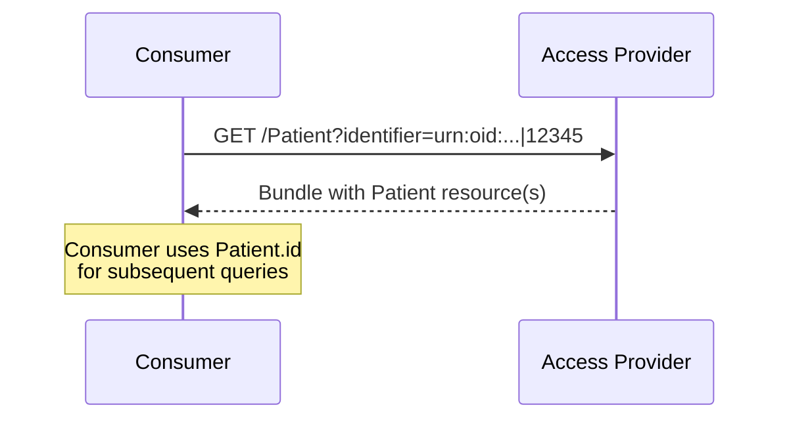

### Overview

Patient lookup resolves the Patient resource an Access Provider holds, so a Consumer can query that patient's health information. It uses IHE PDQm (Patient Demographics Query for Mobile): `Patient.Search` [ITI-78] and the optional `Patient.$match` [ITI-119].

This specification inherits from [IHE PDQm](https://profiles.ihe.net/ITI/PDQm/index.html) with one constraint: the Provider SHALL support the `identifier` search parameter.

Patient identity is resolved before health data is queried. Often it is resolved upstream — by a national patient index or, for cross-border requests, by the National Contact Point (Regulation (EU) 2025/327 Art 13(3)). The Access Provider is then queried with a known identifier and need not perform demographic discovery itself. Lookup is a discovery step; a Consumer that already holds a trusted identifier may skip it and query directly.

`Patient.Search` [ITI-78] by `identifier` is the required, primary path. `Patient.$match` [ITI-119] is optional, for the case where only demographics are available.

### Identification Practices

This specification does not offer open-ended demographic discovery. A Consumer locates a patient it already knows, by identifier. Where no single identifier exists — some Member States identify a patient by an agreed set of attributes — `$match` resolves the patient from those demographics and returns the identifier for subsequent queries. Demographic resolution and cross-border attribute exchange happen above the EHR API, at the national index or National Contact Point.

### Actor Roles

| Actor | Role |
|-------|------|
| Consumer | Find a patient record in the Access Provider system based on identifier or demographics information |
| Document/Resource Access Provider | Return its patient record information based on identifier or demographics queries from a consumer. |

### Transaction Options

Providers support one or both of the following patient identification mechanisms:

#### [ITI-78] Mobile Patient Demographics Query `Patient.Search` - (Required)

Patient search using the [IHE PDQm ITI-78](https://profiles.ihe.net/ITI/PDQm/ITI-78.html) transaction. This specification constrains ITI-78 to require the `identifier` parameter.

```
GET [base]/Patient?identifier=[system]|[value]
```

This approach covers the majority of European use cases where patient identifiers (MRN, national ID) are available.

**Required Search Parameters:**

The Provider SHALL support the `identifier` parameter for patient search. The Consumer SHOULD use it where a trusted identifier is available; not every Member State issues a single patient identifier.

| Parameter | Type | Provider | Consumer | Description |
|-----------|------|----------|----------|-------------|
| identifier | token | SHALL | SHOULD | Patient identifier (e.g., national ID, MRN) |

**Demographic Search Parameters:**

A Provider conformant to PDQm [ITI-78](https://profiles.ihe.net/ITI/PDQm/ITI-78.html) processes the full ITI-78 parameter set. This specification highlights the parameters below as SHOULD for the European context; the rest remain available per ITI-78. A Consumer need not send any of them.

| Parameter | Type | Expectation | Description |
|-----------|------|-------------|-------------|
| family | string | SHOULD | Patient family name |
| given | string | SHOULD | Patient given name |
| birthdate | date | SHOULD | Patient date of birth |
| gender | token | SHOULD | Patient sex or gender |
| address | string | SHOULD | Patient address |
| birthLocation | string | SHOULD | Patient place of birth |
| _id | token | SHOULD | Patient logical ID |

`gender` and `address` are native FHIR `Patient` search parameters. `birthLocation` is not; supporting it requires a custom SearchParameter over the [patient-birthPlace](https://hl7.org/fhir/extensions/StructureDefinition-patient-birthPlace.html) extension. National policies that identify patients by these attributes SHOULD support them.


#### Patient Demographics Match [ITI-119] `Patient.$match`  (Optional)

`$match` identifies a patient from demographics when an identifier-based lookup is not possible — the Consumer does not hold the patient's local identifier. It uses [IHE PDQm ITI-119](https://profiles.ihe.net/ITI/PDQm/ITI-119.html):

`$match` is a separable, composable capability. A Provider MAY implement it directly, or a deployment MAY supply it through a separate identity service (PDQm Patient Demographics Supplier) that the Provider works behind. A Member State MAY mandate the bundled form through procurement. See [Member State Architectures](member-state-architectures.html).

```
POST [base]/Patient/$match
```

The request body contains a Parameters resource with demographic information. The server responds with candidate matches and confidence scores.

**Required Search Parameters:**


| Parameter | Type | Expectation | Description |
|-----------|------|-------------|-------------|
| onlyCertainMatches | boolean | SHALL | This parameter SHALL be set to true |

For safe clinical matching, the Consumer SHALL set `onlyCertainMatches` to `true`, returning only matches certain to be the subject of the request. A Provider MAY behave as if `onlyCertainMatches` were `true` regardless of the request, suppressing low-confidence candidates.

Matching algorithms are product and deployment-specific and may reflect national or region-specific factors (e.g., availability of common demographics, name transliteration, required fields in national patient registries). This specification does not prescribe how matching works, consistent with [PDQm ITI-119](https://profiles.ihe.net/ITI/PDQm/ITI-119.html#231194224-quality-of-match).

#### Chained Identifier Search (Optional)

Once a patient is identified, a Consumer can query that patient's resources directly by identifier using a [chained search parameter](https://hl7.org/fhir/R4/search.html#chaining), skipping a separate lookup round trip. This is a post-match optimization, not an alternative to patient lookup: the identifier comes from a prior lookup or from upstream identity resolution. It applies to clinical resource queries and to document search ([ITI-67]):

```
GET [base]/AllergyIntolerance?patient.identifier=urn:oid:1.2.3|12345
GET [base]/DocumentReference?patient.identifier=urn:oid:1.2.3|12345&type=http://loinc.org|60591-5
```

`patient.identifier` chains the search to the referenced Patient's `identifier`, returning resources for that patient without first fetching the Patient resource. National aggregating gateways use this to minimize round trips. A Provider declaring this option SHALL support `patient.identifier` on the searched resource.

### Provider Requirements

| Actor | Transaction | Optionality |
|-------|-------------|-------------|
| Consumer | Mobile Patient Demographics Query [ITI-78] | R |
|  | Patient Demographics Match [ITI-119] | O |
| Provider | Mobile Patient Demographics Query [ITI-78] | R |
|  | Patient Demographics Match [ITI-119] | O |

Providers are RECOMMENDED to implement the $match operation in addition to the patient search for scenarios where identifier is not available.

A Provider that supports only `Patient.Search` does not serve the no-identifier case: the `identifier` parameter is required, and an identifier-less query is unsupported. Such a Consumer resolves the patient upstream — via `$match` on a separate identity service or the national index — and queries with the resolved identifier. A deployment that must serve identifier-less Consumers directly implements `$match`.

### Authorization

When grouped with IUA actors:
- Consumer uses Get Access Token [ITI-71] with appropriate scope
- Provider enforces authorization via Incorporate Access Token [ITI-72]

### Example


```mermaid
sequenceDiagram
    participant Consumer
    participant Provider as Access Provider

    Consumer->>Provider: GET /Patient?identifier=urn:oid:...|12345
    Provider-->>Consumer: Bundle with Patient resource(s)

    Note over Consumer: Consumer uses Patient.id<br/>for subsequent queries
```

*Patient lookup applies to both [Document Exchange](document-exchange.html) and [Resource Access](resource-access.html) patterns.*

### Design Rationale

In most European exchanges the consumer already holds a trusted patient identifier (national health ID, MRN, or similar). Identifier-based lookup produces an unambiguous match and avoids dependence on demographic data quality, which varies in completeness and localization across member states. The [MyHealth@EU cross-border infrastructure](https://fhir.ehdsi.eu/build/ncp-api/bus-scenario-pat.html) already follows this pattern.

Where an identifier is not available, `Patient.$match` [ITI-119] is safer than demographics-based `Patient.Search` for automated resolution. Both run server-side over the same demographic data; the difference is safety semantics. `$match` returns scored candidates (`search.score`, match-grade) and supports `onlyCertainMatches` to suppress low-confidence results, and it encapsulates the server's matching logic. Demographics-based `Patient.Search` returns unscored results: multiple candidates for common names, missed near-matches from spelling variation (e.g., "Schroeder" vs. "Schröder"), and no confidence signal to guide selection.

### References

- [IHE PDQm](https://profiles.ihe.net/ITI/PDQm/index.html)
    - [ITI-78 Mobile Patient Demographics Query](https://profiles.ihe.net/ITI/PDQm/ITI-78.html)
    - [ITI-119 Patient Demographics Match](https://profiles.ihe.net/ITI/PDQm/ITI-119.html)
- [FHIR Patient.$match](https://hl7.org/fhir/R4/patient-operation-match.html)
