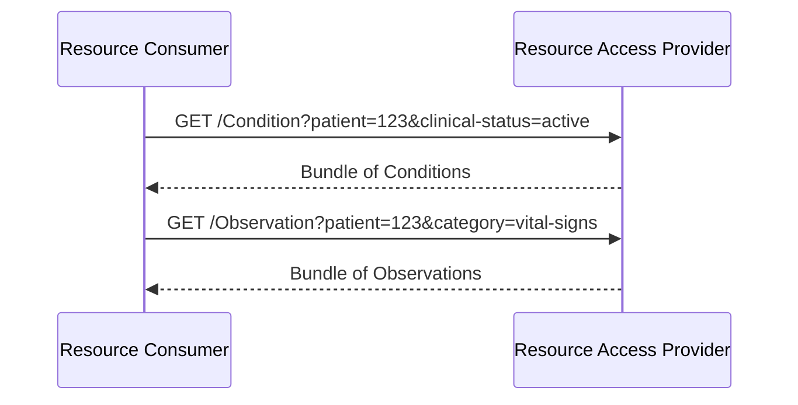
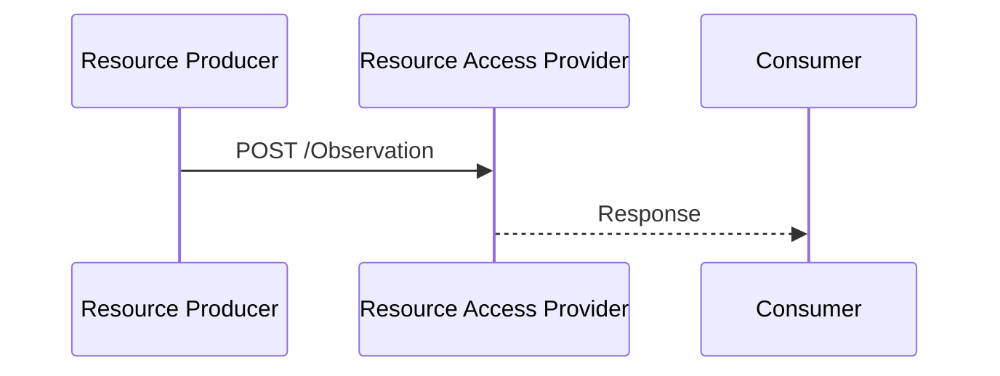

### Overview

Resource access provides access to individual clinical FHIR resources and allows applications to send individual FHIR resources to an EHR. This is a parallel path to [FHIR Document Exchange](document-exchange.html).

A wellness application may integrate with an EHR and use fine-grained health data for informing a patient or a wellness coach of medical conditions or observations, outside healthcare setting.

A remote monitoring solution may feed data from a medical device of a patient to an EHR.

A vaccination registry that serves Immunization resources, or a medication system that serves MedicationStatement resources, uses resource access without necessarily producing complete priority documents.

Systems declare which resources they support.

Resource access for resources that also appear within FHIR Documents (e.g., Conditions referenced in a Patient Summary) is permitted but not required.

Data models for resource access inherit from [HL7 Europe Core](https://build.fhir.org/ig/hl7-eu/base/). This path corresponds to [Resource Interoperability Profiles](regulatoryAnchors.html#xt-ehr-deliverable-81-data-model-and-conformance-framework) in the Xt-EHR D8.1 conformance framework, aligned with the Xt-EHR Logical Models.

### Actors

- **Resource Access Provider** (server): Provides resource query, read, and/or write capabilities
- **Resource Consumer** (client): Queries resources
- **Resource Producer** (client) - Sends individual FHIR resources or Bundles of resources to Resource Access Providers


See [Actors and Transactions](actors.html) for detailed actor groupings.

See [Resource Exchange](resourceExchange.html) for more details on exchange patterns.

### Specifications

This IG aligns with:

- [HL7 SMART App Launch](https://hl7.org/fhir/smart-app-launch/app-launch.html) - Security model including authentication and authorization for wellness apps and medical devices.
- [HL7 International Patient Access (IPA)](https://hl7.org/fhir/uv/ipa/) - Resource access patterns and CapabilityStatements
- [IHE QEDm](https://profiles.ihe.net/PCC/QEDm/) - Query Existing Data mobile, where compatible with IPA. QEDm has a goal of aligning with IPA.
  - [PCC-44](https://profiles.ihe.net/PCC/QEDm/PCC-44.html) - Mobile Query Existing Data transaction

### Sequence Diagrams

#### Query and Read Resources



#### Write Resources



Note: the Producer may also POST a Bundle of resources to the FHIR root (/).

Depending on the use case, either the individual resource or the Bundle may contain Provenance resources that indicate the source of the data.

### Constraints

- **Patient-scoped queries** - `patient` parameter required on all searches
- Searches without `patient` parameter are rejected


### Core Resources

The following resources are available for read/search access. Data models inherit from [HL7 Europe Core](https://build.fhir.org/ig/hl7-eu/base/). Required search parameters are from [International Patient Access (IPA)](https://hl7.org/fhir/uv/ipa/).

| Resource | Required Search Parameters |
|----------|---------------------------|
| AllergyIntolerance | `patient` |
| Condition | `patient` |
| Observation | `patient`, `category` |
| DiagnosticReport | `patient`, `category` |
| MedicationRequest | `patient` |
| MedicationDispense | `patient` |
| MedicationStatement | `patient` |
| Immunization | `patient` |
| Encounter | `patient` |

<div markdown="1" class="stu-note">

This is a core subset of resources for ballot. Ballot feedback is requested on whether this set is appropriate. See [Open Issue #9](open-issues.html#issue-9-core-resource-set-validation).

</div>

### Supported Resources

Following [International Patient Access (IPA)](https://hl7.org/fhir/uv/ipa/CapabilityStatement-ipa-server.html), Resource Access Providers are **not required to support all clinical resources**. Servers MAY choose which resources to implement based on their capabilities, use cases, and the regulatory context.

Servers declare which resources they support in their CapabilityStatement (see [Capability Discovery](capability-discovery.html)). Clients MAY check the server's CapabilityStatement to discover available resources before making requests.

See the [Resource Access Provider CapabilityStatement](CapabilityStatement-EEHRxF-ResourceAccessProvider.html) and [Resource Consumer CapabilityStatement](CapabilityStatement-EEHRxF-ResourceConsumer.html) for detailed capability declarations.

### Scopes

```
system/AllergyIntolerance.rs
system/Condition.rs
system/Observation.rs
system/DiagnosticReport.rs
system/MedicationRequest.rs
system/MedicationDispense.rs
system/MedicationStatement.rs
system/Immunization.rs
system/Encounter.rs
```

### Example Queries

```
GET /AllergyIntolerance?patient=123
GET /Condition?patient=123&clinical-status=active
GET /Observation?patient=123&category=vital-signs&date=ge2024-01-01
GET /DiagnosticReport?patient=123&category=LAB
GET /MedicationRequest?patient=123&status=active
```

### Derived Resources

If resources are derived from documents, Provenance SHOULD link to source DocumentReference:

```json
{
  "resourceType": "Provenance",
  "target": [{"reference": "Observation/123"}],
  "entity": [{
    "role": "source",
    "what": {"reference": "DocumentReference/abc"}
  }]
}
```

The [IHE mXDE](https://profiles.ihe.net/ITI/mXDE/index.html) profile provides more detail on how to extract resources from documents while maintaining provenance.

### References

- [HL7 International Patient Access (IPA)](https://hl7.org/fhir/uv/ipa/)
- [IHE QEDm](https://profiles.ihe.net/PCC/QEDm/)
  - [PCC-44 Mobile Query Existing Data](https://profiles.ihe.net/PCC/QEDm/PCC-44.html)
- [IHE mXDE](https://profiles.ihe.net/ITI/mXDE/index.html)
- [Actors and Transactions](actors.html)

### International Patient Access vs QEDm

This IG uses [International Patient Access (IPA)](https://hl7.org/fhir/uv/ipa/) as the primary reference for CapabilityStatements and search parameters. QEDm is referenced where compatible with International Patient Access - and QEDm has a stated goal of aligning with IPA.
