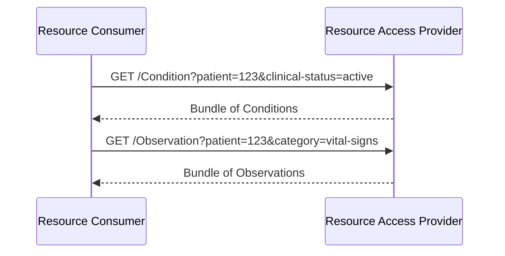

### Overview

Resource access provides query and read access to individual clinical FHIR resources. This is a parallel path to [FHIR Document Exchange](document-exchange.html).

A vaccination registry that serves Immunization resources, or a medication system that serves MedicationStatement resources, uses resource access without necessarily producing complete priority documents. Systems declare which resources they support.

Resource access for resources that also appear within FHIR Documents (e.g., Conditions referenced in a Patient Summary) is permitted but not required.

Data models for resource access inherit from [HL7 Europe Core](https://build.fhir.org/ig/hl7-eu/base/). This path corresponds to [Resource Interoperability Profiles](regulatoryAnchors.html#xt-ehr-deliverable-81-data-model-and-conformance-framework) in the Xt-EHR D8.1 conformance framework, aligned with the Xt-EHR Logical Models.

### Actors

- **Resource Access Provider** (server): Provides resource query capabilities
- **Resource Consumer** (client): Queries resources

See [Actors and Transactions](actors.html) for detailed actor groupings.

<details>
<summary><i>Note: What about Resource Publisher? Click for more</i></summary>

Resource publication is more complex than document publication, and in many cases has resource and use-case specific considerations. Within the scope of this version of the IG, we assume a precondition that the Resource Access Provider has access to resources and focus on defining how the Resource Access Provider enables a consumer to search and read those resources. For more details and possible approaches, see the <a href="resourceExchange.html">Resource Exchange</a> page.

</details>

### Specifications

This IG aligns with:

- [HL7 International Patient Access (IPA)](https://hl7.org/fhir/uv/ipa/) - Resource access patterns and CapabilityStatements
- [IHE QEDm](https://profiles.ihe.net/PCC/QEDm/) - Query Existing Data mobile, where compatible with IPA. QEDm has a goal of aligning with IPA.
  - [PCC-44](https://profiles.ihe.net/PCC/QEDm/PCC-44.html) - Mobile Query Existing Data transaction

### Sequence Diagram


```mermaid
sequenceDiagram
    participant Consumer as Resource Consumer
    participant Provider as Resource Access Provider

    Consumer->>Provider: GET /Condition?patient=123&clinical-status=active
    Provider-->>Consumer: Bundle of Conditions

    Consumer->>Provider: GET /Observation?patient=123&category=vital-signs
    Provider-->>Consumer: Bundle of Observations
```

### Constraints

- **Patient-scoped queries** - `patient` parameter required on all searches
- Searches without `patient` parameter are rejected


### Core Resources

The following resources are available for read/search access. Where an [HL7 Europe Core](https://build.fhir.org/ig/hl7-eu/base/) profile exists for a resource, data models inherit from that profile. Resources not covered by HL7 Europe Core follow the base FHIR R4 specification. Required search parameter combinations align with [IPA STU1](https://hl7.org/fhir/uv/ipa/STU1/CapabilityStatement-ipa-server.html).

| Resource | Required Search Parameters |
|----------|---------------------------|
| AllergyIntolerance | `patient` |
| Condition | `patient` |
| Observation | `patient`, `category` |
| DiagnosticReport | `patient`, `category` |
| MedicationRequest | `patient` |
| MedicationDispense | `patient` |
| MedicationStatement | `patient` |
| Immunization | `patient` |
| Encounter | `patient` |

<div markdown="1" class="stu-note">

This is a core subset of resources for ballot. Ballot feedback is requested on whether this set is appropriate. See [Open Issue #9](open-issues.html#issue-9-core-resource-set-validation).

</div>

### Supported Resources

Following [International Patient Access (IPA)](https://hl7.org/fhir/uv/ipa/CapabilityStatement-ipa-server.html), Resource Access Providers are **not required to support all clinical resources**. Servers MAY choose which resources to implement based on their capabilities, use cases, and the regulatory context.

Servers declare which resources they support in their CapabilityStatement (see [Capability Discovery](capability-discovery.html)). Clients MAY check the server's CapabilityStatement to discover available resources before making requests.

See the [Resource Access Provider CapabilityStatement](CapabilityStatement-EEHRxF-ResourceAccessProvider.html) and [Resource Consumer CapabilityStatement](CapabilityStatement-EEHRxF-ResourceConsumer.html) for detailed capability declarations.

### Scopes

Scopes follow [SMART v2 conventions](https://hl7.org/fhir/smart-app-launch/scopes-and-launch-context.html#scopes-for-requesting-fhir-resources). The context is `system` (server-to-server / Backend Services). The suffix `.read` grants read-by-ID; `.search` grants search. Consumers request the scopes for each resource type they need; servers grant scopes for the resource types they support.

```
system/Patient.read system/Patient.search
system/AllergyIntolerance.read system/AllergyIntolerance.search
system/Condition.read system/Condition.search
system/Observation.read system/Observation.search
system/DiagnosticReport.read system/DiagnosticReport.search
system/MedicationRequest.read system/MedicationRequest.search
system/MedicationDispense.read system/MedicationDispense.search
system/MedicationStatement.read system/MedicationStatement.search
system/Immunization.read system/Immunization.search
system/Encounter.read system/Encounter.search
system/Practitioner.read
system/PractitionerRole.read
system/Organization.read
system/Location.read
```

### Example Queries

```
GET /AllergyIntolerance?patient=123
GET /Condition?patient=123&clinical-status=active
GET /Observation?patient=123&category=vital-signs&date=ge2024-01-01
GET /DiagnosticReport?patient=123&category=LAB
GET /MedicationRequest?patient=123&status=active
```

### Derived Resources

If resources are derived from documents, Provenance SHOULD reference the source document. The source may be a DocumentReference or a FHIR Document Bundle (`Bundle.type = "document"`):

```json
{
  "resourceType": "Provenance",
  "target": [{"reference": "Observation/123"}],
  "entity": [{
    "role": "source",
    "what": {"reference": "DocumentReference/abc"}
  }]
}
```

The [IHE mXDE](https://profiles.ihe.net/ITI/mXDE/index.html) profile (informative) describes how to extract resources from documents while maintaining provenance.

### References

- [HL7 International Patient Access (IPA)](https://hl7.org/fhir/uv/ipa/)
- [IHE QEDm](https://profiles.ihe.net/PCC/QEDm/)
  - [PCC-44 Mobile Query Existing Data](https://profiles.ihe.net/PCC/QEDm/PCC-44.html)
- [IHE mXDE](https://profiles.ihe.net/ITI/mXDE/index.html)
- [Actors and Transactions](actors.html)

### International Patient Access vs QEDm

This IG uses [International Patient Access (IPA)](https://hl7.org/fhir/uv/ipa/) as the primary reference for CapabilityStatements and search parameters. QEDm is referenced where compatible with International Patient Access - and QEDm has a stated goal of aligning with IPA.
