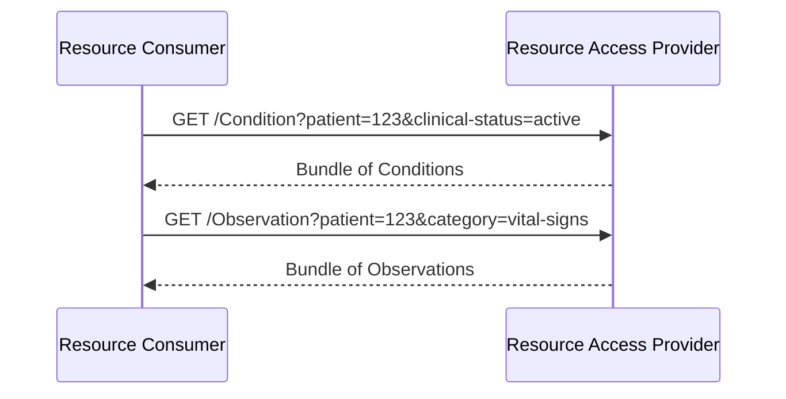

### Overview

Resource access provides query and read access to individual clinical FHIR resources. This is a parallel path to [FHIR Document Exchange](document-exchange.html).

A vaccination registry that serves Immunization resources, or a medication system that serves MedicationStatement resources, uses resource access without necessarily producing complete priority documents. Systems declare which resources they support.

Resource access for resources that also appear within FHIR Documents (e.g., Conditions referenced in a Patient Summary) is permitted but not required.

Data models for resource access inherit from [HL7 Europe Core](https://build.fhir.org/ig/hl7-eu/base/). This path corresponds to [Resource Interoperability Profiles](regulatoryAnchors.html#xt-ehr-deliverable-81-data-model-and-conformance-framework) in the Xt-EHR D8.1 conformance framework, aligned with the Xt-EHR Logical Models.

### Actors

- **Resource Access Provider** (server): Provides resource query capabilities
- **Resource Consumer** (client): Queries resources

See [Actors and Transactions](actors.html) for detailed actor groupings.

**Resource publication** (write access) is out of scope for this version of the IG. The Resource Access Provider is defined as a read-only query actor. For background on how resources reach the provider, see [Resource Exchange](resourceExchange.html).

### Specifications

This IG aligns with:

- [HL7 International Patient Access (IPA) STU1](https://hl7.org/fhir/uv/ipa/STU1/) — resource access patterns and CapabilityStatements
- [IHE QEDm](https://profiles.ihe.net/PCC/QEDm/) — where compatible with IPA (QEDm aligns with IPA)

### Sequence Diagram


```mermaid
sequenceDiagram
    participant Consumer as Resource Consumer
    participant Provider as Resource Access Provider

    Consumer->>Provider: GET /Condition?patient=123&clinical-status=active
    Provider-->>Consumer: Bundle of Conditions

    Consumer->>Provider: GET /Observation?patient=123&category=vital-signs
    Provider-->>Consumer: Bundle of Observations
```

### Core Resources

The following resources are available for read/search access. Where an [HL7 Europe Core](https://build.fhir.org/ig/hl7-eu/base/) profile exists for a resource, data models inherit from that profile. Resources not covered by HL7 Europe Core follow the base FHIR R4 specification. Required search parameter combinations align with [IPA STU1](https://hl7.org/fhir/uv/ipa/STU1/CapabilityStatement-ipa-server.html).

**Patient** — for lookup context; not a primary clinical resource in this actor.

- SHALL: `identifier` in `[system]|[value]` form (both components required)

**Patient-scoped clinical resources** — SHALL support `patient` on all searches.

| Resource | SHALL combos | SHOULD combos |
|----------|-------------|---------------|
| AllergyIntolerance | `patient` | `patient+clinical-status` |
| Condition | `patient` | `patient+clinical-status`, `patient+category`, `patient+code` |
| Observation | `patient+category`, `patient+code`, `patient+category+date` | `patient+code+date`, `patient+category+status` |
| DiagnosticReport | `patient+category` | `patient+code`, `patient+category+date` |
| MedicationRequest | `patient` | `patient+intent`, `patient+status` |
| MedicationDispense | `patient` | `patient+status` |
| MedicationStatement | `patient` | `patient+status` |
| Immunization | `patient` | `patient+date` |
| Encounter | `patient` | `patient+date`, `patient+status` |

**Reference-only resources** — not patient-scoped; `patient` search parameter does not apply. Servers SHALL support read by logical ID for each supported resource.

| Resource | SHALL | Purpose |
|----------|-------|---------|
| Practitioner | read | resolve practitioner references |
| PractitionerRole | read | resolve role-in-organization references |
| Organization | read | resolve organization references |
| Location | read | resolve location references |

**Additional patient-scoped resources** — supported where applicable to priority category.

| Resource | SHALL combos | Priority Category |
|----------|-------------|------------------|
| ImagingStudy | `patient` | Imaging Results |

<div markdown="1" class="stu-note">

This is a core subset of resources for ballot. Ballot feedback is requested on whether this set is appropriate. See [Open Issue #9](open-issues.html#issue-9-core-resource-set-validation).

</div>

### On-Demand Documents

Some clinical artifacts (for example, a Patient Summary assembled at request time) are not pre-stored but generated on demand. MHD's ITI-67 query semantics accommodate on-demand documents via DocumentReference: a DocumentReference with absent `content.attachment.hash` and `content.attachment.size` signals that the document will be generated when fetched (ITI-68). The Resource Access Provider is not required to implement on-demand generation; this is a valid implementation pattern for systems that assemble documents from their resource store.

For implementations that align with [IPA](https://hl7.org/fhir/uv/ipa/STU1/), the IPA `$docref` operation ([OperationDefinition-docref](https://hl7.org/fhir/uv/ipa/STU1/OperationDefinition-docref.html)) provides an equivalent on-demand document request mechanism on the IPA side. An IPA-aligned Resource Access Provider MAY support `$docref` in addition to the ITI-67/68 path.

### Supported Resources

Resource Access Providers are **not required to support all listed resources**, following [IPA STU1](https://hl7.org/fhir/uv/ipa/STU1/CapabilityStatement-ipa-server.html). Servers MAY choose which resources to implement based on capabilities, use cases, and regulatory context.

Servers declare supported resources in their CapabilityStatement (see [Capability Discovery](capability-discovery.html)). Clients SHOULD check the server's CapabilityStatement before requesting.

See the [Resource Access Provider CapabilityStatement](CapabilityStatement-EEHRxF-ResourceAccessProvider.html) and [Resource Consumer CapabilityStatement](CapabilityStatement-EEHRxF-ResourceConsumer.html) for capability declarations.

### Scopes

Scopes follow [SMART v2 conventions](https://hl7.org/fhir/smart-app-launch/scopes-and-launch-context.html#scopes-for-requesting-fhir-resources). The context is `system` (server-to-server / Backend Services). The suffix `.read` grants read-by-ID; `.search` grants search. Consumers request the scopes for each resource type they need; servers grant scopes for the resource types they support.

```
system/Patient.read system/Patient.search
system/AllergyIntolerance.read system/AllergyIntolerance.search
system/Condition.read system/Condition.search
system/Observation.read system/Observation.search
system/DiagnosticReport.read system/DiagnosticReport.search
system/MedicationRequest.read system/MedicationRequest.search
system/MedicationDispense.read system/MedicationDispense.search
system/MedicationStatement.read system/MedicationStatement.search
system/Immunization.read system/Immunization.search
system/Encounter.read system/Encounter.search
system/Practitioner.read
system/PractitionerRole.read
system/Organization.read
system/Location.read
```

### Example Queries

Required combinations (SHALL):

```
GET /AllergyIntolerance?patient=123
GET /Condition?patient=123
GET /Observation?patient=123&category=vital-signs
GET /Observation?patient=123&code=8867-4
GET /DiagnosticReport?patient=123&category=LAB
GET /MedicationRequest?patient=123
GET /Immunization?patient=123
```

Optional combinations (SHOULD):

```
GET /Condition?patient=123&clinical-status=active
GET /Observation?patient=123&category=vital-signs&date=ge2024-01-01
GET /MedicationRequest?patient=123&status=active&intent=order
```

### Derived Resources

If resources are derived from documents, Provenance SHOULD reference the source document. The source may be a DocumentReference or a FHIR Document Bundle (`Bundle.type = "document"`):

```json
{
  "resourceType": "Provenance",
  "target": [{"reference": "Observation/123"}],
  "entity": [{
    "role": "source",
    "what": {"reference": "DocumentReference/abc"}
  }]
}
```

The [IHE mXDE](https://profiles.ihe.net/ITI/mXDE/index.html) profile (informative) describes how to extract resources from documents while maintaining provenance.

### References

- [HL7 International Patient Access (IPA) STU1](https://hl7.org/fhir/uv/ipa/STU1/) — normative reference for search parameters and CapabilityStatements
- [IPA CapabilityStatement (STU1)](https://hl7.org/fhir/uv/ipa/STU1/CapabilityStatement-ipa-server.html)
- [IPA $docref operation (STU1)](https://hl7.org/fhir/uv/ipa/STU1/OperationDefinition-docref.html)
- [IHE QEDm](https://profiles.ihe.net/PCC/QEDm/) — where compatible with IPA
- [IHE mXDE](https://profiles.ihe.net/ITI/mXDE/index.html) — informative; provenance pattern for document-derived resources
- [Actors and Transactions](actors.html)
