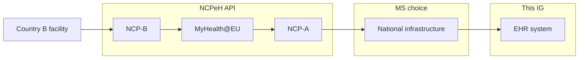

### Overview

Cross-border exchange routes through National Contact Points (NCPs) over the MyHealth@EU network ([Art. 23(2)](https://eur-lex.europa.eu/legal-content/EN/TXT/HTML/?uri=OJ:L_202500327#art_23)). When a patient from Country A receives care in Country B, Country B's NCP requests the patient's data from Country A's NCP, which then queries national infrastructure to retrieve it.

This IG defines the Interoperability Component API surface used at the **final step** — how national infrastructure (or the NCP itself) queries EHR systems for the patient's data.

### Scope

NCP-to-NCP exchange over MyHealth@EU is governed by the [NCPeH API specification](https://build-fhir.ehdsi.eu/ncp-api/), not by this IG. National infrastructure design — how a Member State routes an NCP query to the holding EHR systems — is a Member State choice (see [Cross-Organization via National Infrastructure](usecase-cross-org.html)).

### Participants

- **NCP or national infrastructure** — acts as [Document Consumer](actors.html#document-consumer) and/or [Resource Consumer](actors.html#resource-consumer) of the Interoperability Component API surface
- **EHR system** — [Document Access Provider](actors.html#document-access-provider) and/or [Resource Access Provider](actors.html#resource-access-provider); the conformance target of this IG

### Architecture



All layers exchange EEHRxF-formatted data.

### Authorization

Cross-border patient consent, health-professional authentication in the requesting country, and authorization at the NCP and national-infrastructure layers are governed by MyHealth@EU and Member State infrastructure — not by this IG. At the Interoperability Component API surface, the consumer is an authorized national-infrastructure component; how that authorization was established is out of scope here.

At that API boundary, the consumer and protected EHR endpoint have the generic [EU Authorization Client](ActorDefinition-eu-authorization-client-eu-api.html) and [EU Authorization Resource Server](ActorDefinition-eu-authorization-resource-server-eu-api.html) roles. Any Authorization Server is a distinct participant; the applicable protocol roles and MyHealth@EU recommendation are described in [Authorization](authorization.html).
